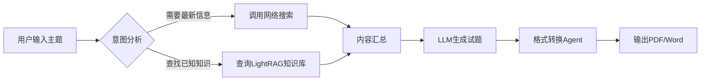
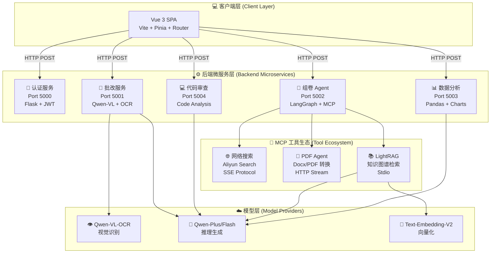

<div align="center">

# 🎓 师小助 (Teacher Assistant AI)

### 基于 Agentic AI 架构的下一代智能教学辅助平台

[](LICENSE)
[](https://www.python.org/)
[](https://vuejs.org/)
[](https://www.langchain.com/)
[](https://www.langchain.com/langgraph)
[](https://modelcontextprotocol.io/)
[](https://dashscope.aliyun.com/)

[English](README_EN.md) | 简体中文

[特性](#-核心特性) • [架构](#-系统架构) • [快速开始](#-快速开始) • [文档](#-项目文档) • [贡献](#-参与贡献)

</div>

---

## 📖 项目简介

**师小助 (Teacher Assistant AI)** 是一个革命性的教育科技平台，致力于通过前沿的人工智能技术解放教师生产力，提升教学质量。项目采用 **Agentic AI（代理式人工智能）** 架构，深度集成了 LangChain、LangGraph、LightRAG 和 Model Context Protocol (MCP)，打造出一个真正"会思考"的智能助教系统。

### 💡 为什么选择师小助？

传统教学工具往往是"点对点"的功能堆砌，而师小助通过 **Agent 编排** 实现了：

- 🧠 **自主推理决策**：系统能够根据教师需求自动选择工具和路径
- 🔄 **动态工作流**：基于 LangGraph 的状态机实现复杂任务编排
- 🔌 **无限扩展性**：通过 MCP 协议轻松集成新的 AI 能力
- 🎯 **精准个性化**：为每个学生提供定制化的学习建议
- 📚 **知识图谱支持**：基于 LightRAG 的知识库实现深度语义检索

### 🎯 核心价值

| 🎓 **教师端** | 📚 **学生端** | 🏫 **学校端** |
|:---:|:---:|:---:|
| 节省 60% 批改时间 | 获得个性化学习路径 | 数据驱动决策支持 |
| 智能生成教学材料 | 24/7 在线答疑 | 提升整体教学质量 |
| 全面学情分析 | 即时反馈与改进 | 降低运营成本 |

---

## ✨ 核心特性

### 🧠 1. 智能组卷系统 (Agentic Quiz Generation)

基于 **LangGraph 工作流编排**、**LightRAG 知识图谱** 和 **MCP 协议** 的高级组卷引擎：

#### 🔍 核心能力
- **智能路由器 (Smart Router)**
  - 自动分析用户意图（如"最新技术趋势" vs "基础概念复习"）
  - 在「联网搜索」和「本地 RAG 知识库」间智能切换
  - 支持混合策略：同时使用多个数据源增强答案质量

- **LightRAG 知识图谱引擎**
  - 使用 [LightRAG](https://github.com/HKUDS/LightRAG) 构建知识图谱
  - 支持多模式检索：本地、全局、混合、混合+、朴素模式
  - 基于图结构的深度语义关联检索
  - 支持向量化存储与快速召回

- **MCP 工具生态**
  - 基于 FastMCP 封装的知识库服务器
  - 标准化的工具调用接口
  - 支持网络搜索、PDF 转换等多种工具

- **多格式输出**
  - 自动生成结构化 Markdown 试卷
  - 一键转换为 PDF 格式
  - 支持 Word/Excel 等多种导出格式

#### 📊 工作流程



---

### 📝 2. 多模态智能批改 (Multimodal Grading)

利用 **Qwen-VL-OCR** 视觉大模型实现的自动化阅卷系统：

#### 👁️ 视觉识别能力
- **手写识别**：精准识别各种笔迹风格
- **选择题提取**：自动识别 A/B/C/D 等选项标记
- **表格识别**：支持填空题、计算题等复杂格式
- **图形理解**：可分析几何图形、函数图像等

#### 📄 双流输入系统
1. **标准答案流**：支持 `.docx`、`.txt`、`.pdf` 格式
2. **学生答卷流**：支持 `.jpg`、`.png`、`.pdf`（扫描件）

#### 📊 结构化输出报告

生成的批改报告包含三大模块：

<table>
<tr>
<td width="33%" align="center">

**📈 成绩看板**

总分、平均分<br>
排名与分布图

</td>
<td width="33%" align="center">

**📝 逐题精批**

每题得分详情<br>
失分原因分析

</td>
<td width="33%" align="center">

**💡 改进建议**

知识点薄弱环节<br>
个性化学习路径

</td>
</tr>
</table>

#### 🎯 应用场景
- ✅ 选择题自动判分（准确率 >98%）
- ✅ 填空题智能比对（支持多种答案形式）
- ✅ 简答题语义分析（关键词提取 + 逻辑判断）
- 🚧 作文自动评分（计划中：基于 LLM 的文采分析）

---

### 💻 3. 代码智能审查 (AI Code Review)

专为编程教学设计的代码辅导与审查工具：

#### 🛠️ 支持的编程语言
Python | Java | C++ | JavaScript | TypeScript | Go | Rust | PHP

#### 🔍 审查维度

| 维度 | 检查项 | 示例 |
|:---:|:---|:---|
| **语法检查** | 语法错误、类型错误、缺少导入 | `NameError: name 'pd' is not defined` |
| **逻辑分析** | 死循环、未处理异常、边界条件 | `if` 语句逻辑重复 |
| **性能优化** | 时间复杂度、内存泄漏、不必要的循环 | `O(n²)` → `O(n)` 优化建议 |
| **代码风格** | PEP8/Google Style、命名规范 | 变量名 `a1` → `student_count` |
| **安全性** | SQL 注入、XSS 漏洞、敏感信息泄露 | 检测未加密的密码存储 |

#### 🎓 教学模式
- **引导式修复**：不直接给出答案，而是提出思考问题
- **举一反三**：提供类似错误的对比案例
- **进阶挑战**：在完成基础修复后推荐进阶练习

---

### 📊 4. 学情数据分析 (Data Insight Engine)

基于 **Pandas** 和 **LLM** 的数据洞察系统，将冰冷的数字转化为可操作的教学建议。

#### 📈 可视化图表

<table>
<tr>
<td align="center">

**成绩趋势图**<br>
折线图展示<br>
各科目进步曲线

</td>
<td align="center">

**学科雷达图**<br>
六边形雷达<br>
多维能力分析

</td>
<td align="center">

**进退步柱状图**<br>
横向对比<br>
班级排名变化

</td>
</tr>
</table>

#### 🤖 AI 顾问功能

系统会根据数据自动生成：

1. **短期学习计划** (1-2 周)
   - 薄弱知识点针对性训练
   - 每日学习任务分解
   - 进度跟踪与调整建议

2. **长期成长路径** (1 学期 - 1 年)
   - 科目平衡策略
   - 竞赛/特长发展建议
   - 升学目标匹配分析

3. **生涯规划建议**
   - 专业选择倾向分析
   - 职业兴趣匹配
   - 能力模型构建

#### 📥 数据源支持
- 📊 Excel/CSV 批量导入
- ✏️ 手动录入成绩
- 🔗 教务系统 API 对接（计划中）

---

## 🏗️ 系统架构

### 技术栈概览

#### 🖥️ 后端技术栈 (Python)

<table>
<tr>
<td><b>框架</b></td>
<td>Flask (微服务架构)</td>
</tr>
<tr>
<td><b>AI 编排</b></td>
<td>LangChain, LangGraph</td>
</tr>
<tr>
<td><b>知识图谱</b></td>
<td>LightRAG</td>
</tr>
<tr>
<td><b>协议</b></td>
<td>Model Context Protocol (FastMCP)</td>
</tr>
<tr>
<td><b>LLM 服务</b></td>
<td>Aliyun DashScope (Qwen 系列)</td>
</tr>
<tr>
<td><b>数据处理</b></td>
<td>Pandas, NumPy, Matplotlib</td>
</tr>
<tr>
<td><b>向量存储</b></td>
<td>LightRAG 内置存储</td>
</tr>
</table>

#### 🎨 前端技术栈 (Vue 3)

<table>
<tr>
<td><b>核心框架</b></td>
<td>Vue 3 (Composition API + <code>&lt;script setup&gt;</code>)</td>
</tr>
<tr>
<td><b>构建工具</b></td>
<td>Vite</td>
</tr>
<tr>
<td><b>状态管理</b></td>
<td>Pinia</td>
</tr>
<tr>
<td><b>路由</b></td>
<td>Vue Router 4</td>
</tr>
<tr>
<td><b>UI 组件</b></td>
<td>自定义组件 + 响应式布局</td>
</tr>
<tr>
<td><b>HTTP 客户端</b></td>
<td>Axios</td>
</tr>
<tr>
<td><b>样式</b></td>
<td>Scoped CSS, Flexbox/Grid</td>
</tr>
</table>

### 🏛️ 系统架构图



### 📂 项目目录结构

```
Teacher_Assistant_AI/
├── 📁 backend/                    # 后端服务
│   ├── 📁 Achievement_analysis/   # 学情分析模块
│   │   ├── data_analyzer.py       # 数据分析服务 (Port 5003)
│   │   └── requirements.txt
│   │
│   ├── � Code_correction/        # 代码审查模块
│   │   └── Code_correction.py     # 代码审查服务 (Port 5004)
│   │
│   ├── 📁 Login/                  # 认证模块
│   │   └── login.py               # 认证服务 (Port 5000)
│   │
│   ├── 📁 Paper_composition/      # 智能组卷模块
│   │   ├── main.py                # 组卷主入口 (Port 5002)
│   │   ├── RAG_MCP_LightRAG.py    # LightRAG MCP Server
│   │   ├── lightrag_config.py     # LightRAG 配置
│   │   └── lightrag_storage/      # LightRAG 知识库存储
│   │
│   ├── 📁 Paper_marking/          # 智能批改模块
│   │   └── marking.py             # 批改服务 (Port 5001)
│   │
│   ├── 📁 logs/                   # 日志存储
│   │   └── lightrag.log           # LightRAG 运行日志
│   │
│   ├── main.py                    # 服务启动器
│   └── requirements.txt           # Python 依赖
│
├── 📁 frontend/                   # 前端项目
│   ├── src/
│   │   ├── views/                 # 页面组件
│   │   │   ├── LoginPage.vue
│   │   │   ├── HomePage.vue
│   │   │   ├── QuizGeneration.vue
│   │   │   ├── GradingPage.vue
│   │   │   ├── DataAnalysis.vue
│   │   │   └── CodeReview.vue
│   │   ├── stores/                # Pinia 状态管理
│   │   ├── router/                # Vue Router
│   │   ├── assets/                # 静态资源
│   │   └── App.vue
│   ├── package.json
│   └── vite.config.js
│
├── 📁 Files/                       # 静态资源
├── 📁 智能批改/                    # 批改模块资源
├── 📁 成绩分析/                    # 分析模块资源
├── 📁 智能组卷/                    # 组卷模块资源
│
├── .env.example                   # 环境变量模板
├── .gitignore                     # Git 忽略配置
├── LICENSE                        # 许可证
└── README.md                      # 项目文档
```

---

## 🚀 快速开始

### 📋 前置要求

在开始之前，请确保您的系统满足以下要求：

<table>
<tr>
<td><b>Python</b></td>
<td>3.10 或更高版本</td>
<td><a href="https://www.python.org/downloads/">下载链接</a></td>
</tr>
<tr>
<td><b>Node.js</b></td>
<td>16.x 或更高版本</td>
<td><a href="https://nodejs.org/">下载链接</a></td>
</tr>
<tr>
<td><b>API Key</b></td>
<td>阿里云 DashScope API Key</td>
<td><a href="https://dashscope.aliyun.com/">获取地址</a></td>
</tr>
<tr>
<td><b>操作系统</b></td>
<td>Windows, Linux, macOS</td>
<td>-</td>
</tr>
</table>

### 📥 1. 克隆项目

```bash
# 使用 HTTPS
git clone https://github.com/abaiar/Teacher_Assistant_AI.git

# 或使用 SSH (推荐)
git clone git@github.com:abaiar/Teacher_Assistant_AI.git

cd Teacher_Assistant_AI
```

### 🐍 2. 后端环境配置

#### 2.1 创建虚拟环境 (推荐)

```bash
# 使用 Conda (推荐)
conda create -n teacher_ai python=3.10
conda activate teacher_ai

# 或使用 venv
python -m venv venv
# Windows:
venv\Scripts\activate
# Linux/macOS:
source venv/bin/activate
```

#### 2.2 安装 Python 依赖

```bash
pip install -r backend/requirements.txt
```

**常见问题解决**：
- 如果遇到网络问题，可使用清华镜像：
  ```bash
  pip install -r backend/requirements.txt -i https://pypi.tuna.tsinghua.edu.cn/simple
  ```

#### 2.3 配置环境变量

1. 复制环境变量模板：
   ```bash
   cp .env.example .env
   ```

2. 编辑 `.env` 文件，填入您的 API Key：
   ```env
   # .env 文件内容
   DASHSCOPE_API_KEY=sk-xxxxxxxxxxxxxxxxxxxxxxxx
   ```

3. **重要安全提示**：
   - ⚠️ 切勿将 `.env` 文件提交到版本控制系统
   - ✅ 确保 `.gitignore` 包含 `.env` 条目
   - 🔒 妥善保管您的 API Key

#### 2.4 启动后端服务

**方式一：使用主启动器（推荐）**

```bash
cd backend
python main.py
```

主启动器会自动启动所有微服务：
- 认证服务 (Port 5000)
- 批改服务 (Port 5001)
- 组卷服务 (Port 5002)
- 数据分析服务 (Port 5003)
- 代码审查服务 (Port 5004)

**方式二：手动启动（开发调试）**

打开多个终端窗口，分别执行：

```bash
# 终端 1: 认证服务 (Port 5000)
python backend/Login/login.py

# 终端 2: 批改服务 (Port 5001)
python backend/Paper_marking/marking.py

# 终端 3: 组卷服务 (Port 5002)
python backend/Paper_composition/main.py

# 终端 4: 数据分析服务 (Port 5003)
python backend/Achievement_analysis/data_analyzer.py

<<<<<<< HEAD
# 终端 5: 代码审查 (Port 5004)
python 代码批改.py
```

**方式二:使用 PM2(生产环境推荐)**

```bash
# 安装 PM2
npm install -g pm2

# 启动所有服务
pm2 start ecosystem.config.js

# 查看状态
pm2 status

# 查看日志
npm run logs
```

**方式三:Docker Compose(即将支持)**

```bash
# 一键启动所有服务(开发中)
docker-compose up -d
=======
# 终端 5: 代码审查服务 (Port 5004)
python backend/Code_correction/Code_correction.py
>>>>>>> 234c34fa9492d98e2a36b629168c3649eab63af5
```

#### 2.5 验证后端服务

访问以下端点确认服务正常运行：

```bash
# 检查组卷服务
curl http://localhost:5002/health

# 检查数据分析服务
curl http://localhost:5003/health
```

### 🎨 3. 前端环境配置

#### 3.1 进入前端目录

```bash
<<<<<<< HEAD
cd 项目前端
=======
cd frontend
>>>>>>> 234c34fa9492d98e2a36b629168c3649eab63af5
```

#### 3.2 安装依赖

```bash
# 使用 npm
npm install

# 或使用 yarn
yarn install

# 或使用 pnpm
pnpm install
```

#### 3.3 启动开发服务器

```bash
npm run dev
```

成功启动后，您将看到类似输出：

```
  VITE v6.0.5  ready in 523 ms

  ➜  Local:   http://localhost:5173/
  ➜  Network: http://192.168.1.100:5173/
```

#### 3.4 访问应用

在浏览器中打开 `http://localhost:5173`，您将看到登录页面。

**默认测试账号**：
- 用户名：`teacher`
- 密码：`123456`

---

## 📚 项目文档

### 🧪 使用案例

#### 案例 1：生成综合试卷

**场景**：数学老师需要为期中考试生成一份涵盖"函数"、"三角函数"、"数列"的综合试卷。

**操作步骤**：

1. **登录系统**
   - 访问 `http://localhost:5173`
   - 输入教师账号登录

2. **配置试卷参数**
   - 主题：高中数学：函数、三角函数、数列综合测试
   - 难度：中等
   - 题目数量：20
   - 题型分布：选择题10题，填空题5题，解答题5题

3. **生成与下载**
   - 系统在 30 秒内生成试卷
   - 下载 Markdown 原稿或 PDF 打印版

#### 案例 2：批量批改编程作业

**场景**：计算机老师需要批改 50 份 Python 作业。

**效率对比**：

| 对比项 | 传统手工批改 | 师小助自动批改 |
|:---:|:---:|:---:|
| **平均每份耗时** | 10 分钟 | 30 秒 |
| **总耗时** | 8.3 小时 | 25 分钟 |
| **效率提升** | - | **20 倍** |

#### 案例 3：学情数据分析

**场景**：班主任需要为家长会准备全班 40 人的学情分析报告。

**操作步骤**：

1. **导出成绩数据** (Excel 格式)
2. **上传到系统**
   - 导航至「学情分析」页面
   - 上传 Excel 文件
   - 系统自动识别表头和数据
3. **生成分析报告**
   - 班级整体报告（成绩分布、排名分析）
   - 个人成长报告（趋势图、雷达图、AI建议）

---

### 🔧 高级配置

#### 自定义 LightRAG 知识库

如果您希望添加自己的教学材料到知识库：

1. **准备文档**
   - 支持格式：`.txt`, `.md`, `.pdf`, `.docx`
   - 建议每个文档 <5000 字

2. **调用插入接口**
   ```python
   # 使用 LightRAG MCP 工具插入文档
   await insert_document("您的文档内容", "文档标题")
   ```

3. **验证检索**
   - 使用查询接口测试知识库检索效果
   - 支持多种检索模式：local、global、hybrid、mix、naive

#### 配置日志路径

LightRAG 日志默认存储在 `backend/logs/lightrag.log`。如需修改：

编辑 `backend/Paper_composition/RAG_MCP_LightRAG.py`：

```python
# 修改日志目录
log_dir = Path(__file__).parent.parent / "your_custom_logs"
```

---

## 🐛 故障排查

### 常见问题 (FAQ)

#### Q1: 提示 "DASHSCOPE_API_KEY not found"

**原因**：环境变量未正确配置。

**解决方案**：
1. 确认 `.env` 文件存在且包含正确的 API Key
2. 检查是否激活了虚拟环境
3. 尝试手动设置环境变量：
   ```bash
   # Windows
   set DASHSCOPE_API_KEY=your-key-here
   # Linux/macOS
   export DASHSCOPE_API_KEY=your-key-here
   ```

#### Q2: 端口被占用 (Address already in use)

**原因**：端口 5000-5004 被其他程序占用。

**解决方案**：
1. 查找占用进程：
   ```bash
   # Windows
   netstat -ano | findstr :5000
   # Linux/macOS
   lsof -i :5000
   ```
2. 结束占用进程或修改服务端口配置

#### Q3: LightRAG 初始化失败

**原因**：知识库目录权限问题或依赖缺失。

**解决方案**：
1. 检查 `backend/Paper_composition/lightrag_storage/` 目录权限
2. 确保已安装所有依赖：`pip install lightrag`
3. 查看 `backend/logs/lightrag.log` 获取详细错误信息

#### Q4: 前端无法连接后端 (Network Error)

**原因**：CORS 配置问题或后端服务未启动。

**解决方案**：
1. 确认所有后端服务正在运行
2. 检查各服务的 CORS 配置是否允许前端域名
3. 浏览器控制台查看具体错误信息

---

## 📊 性能基准

**测试环境**：
- CPU: Intel i7-10700K
- RAM: 16GB DDR4
- OS: Windows 10/11

| 功能模块 | 平均响应时间 | 并发能力 | 备注 |
|:---:|:---:|:---:|:---|
| 智能组卷 | 15-30 秒 | 10 QPS | 取决于题目数量 |
| LightRAG 查询 | 2-5 秒 | 20 QPS | 取决于知识库大小 |
| 图片批改 | 5-10 秒/张 | 5 QPS | 分辨率影响较大 |
| 代码审查 | 3-8 秒 | 15 QPS | 代码行数影响 |
| 数据分析 | 10-20 秒 | 8 QPS | 学生数量影响 |

---

## 🤝 参与贡献

我们欢迎所有形式的贡献，无论是新功能、bug 修复还是文档改进。

### 贡献流程

1. **Fork 项目**
   ```bash
   git clone https://github.com/your-username/Teacher_Assistant_AI.git
   ```

2. **创建分支**
   ```bash
   git checkout -b feature/your-feature-name
   ```

3. **提交更改**
   ```bash
   git add .
   git commit -m "feat: add your feature description"
   ```

4. **推送分支**
   ```bash
   git push origin feature/your-feature-name
   ```

5. **创建 Pull Request**

### 代码规范

- 遵循 PEP8 Python 代码规范
- 使用类型注解提高代码可读性
- 编写清晰的提交信息（遵循 Conventional Commits）
- 添加必要的单元测试

---

## � 许可证

本项目采用 [MIT 许可证](LICENSE) 开源。

```
MIT License

Copyright (c) 2024-2025 Teacher Assistant AI Contributors

Permission is hereby granted, free of charge, to any person obtaining a copy
of this software and associated documentation files (the "Software"), to deal
in the Software without restriction, including without limitation the rights
to use, copy, modify, merge, publish, distribute, sublicense, and/or sell
copies of the Software, and to permit persons to whom the Software is
furnished to do so, subject to the following conditions:

The above copyright notice and this permission notice shall be included in all
copies or substantial portions of the Software.
```

---

## 🙏 致谢

感谢以下开源项目和工具的支持：

- [LangChain](https://www.langchain.com/) - AI 应用开发框架
- [LangGraph](https://www.langchain.com/langgraph) - 工作流编排引擎
- [LightRAG](https://github.com/HKUDS/LightRAG) - 知识图谱检索框架
- [FastMCP](https://modelcontextprotocol.io/) - MCP 协议实现
- [DashScope](https://dashscope.aliyun.com/) - 阿里云大模型服务
- [Vue.js](https://vuejs.org/) - 前端框架
- [Flask](https://flask.palletsprojects.com/) - Web 框架

---

<div align="center">

**[⬆ 回到顶部](#-师小助-teacher-assistant-ai)**

Made with ❤️ by Teacher Assistant AI Team

</div>