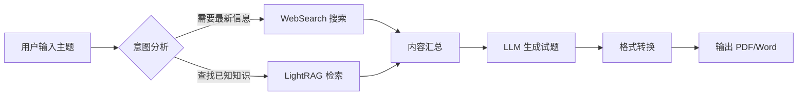
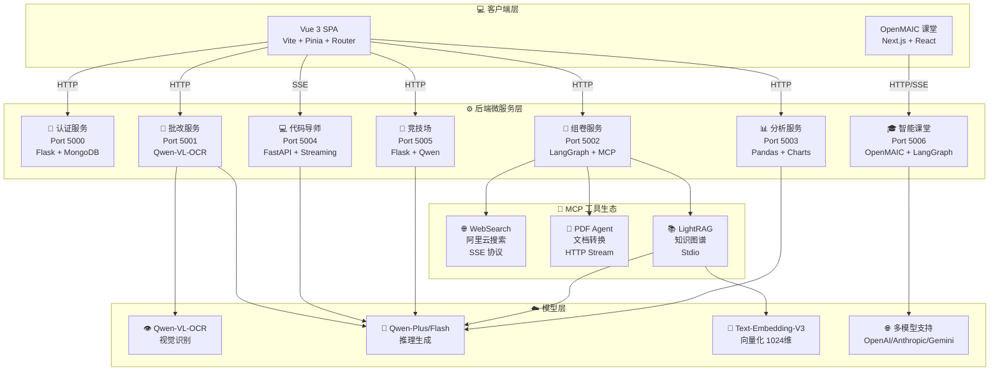

<div align="center">


# 🎓 师小助 (Teacher Assistant AI)

### 下一代智能教学辅助平台 | 基于 Agentic AI 架构

<p align="center">
  <a href="#-核心特性">特性</a> •
  <a href="#-系统架构">架构</a> •
  <a href="#-快速开始">快速开始</a> •
  <a href="#-api-文档">API</a> •
  <a href="#-开发指南">开发</a> •
  <a href="#-贡献指南">贡献</a>
</p>

[](LICENSE)
[](https://www.python.org/)
[](https://vuejs.org/)
[](https://www.langchain.com/)
[](https://www.langchain.com/langgraph)
[](https://modelcontextprotocol.io/)
[](https://dashscope.aliyun.com/)

[English](README_EN.md) | 简体中文

</div>

---

## 📖 项目简介

**师小助 (Teacher Assistant AI)** 是一款革命性的教育科技平台，致力于通过前沿人工智能技术解放教师生产力、提升教学质量。项目采用 **Agentic AI（代理式人工智能）** 架构，深度集成 LangChain、LangGraph、LightRAG 和 Model Context Protocol (MCP)，打造真正"会思考"的智能助教系统。

### 💡 核心亮点

<table>
<tr>
<td width="50%">

🧠 **自主推理决策**
- 智能意图分析，自动选择最优工具链
- 动态工作流编排，复杂任务自动拆解

</td>
<td width="50%">

🔄 **多模态处理能力**
- OCR 视觉识别，手写试卷精准批改
- 代码语义分析，苏格拉底式教学引导

</td>
</tr>
<tr>
<td width="50%">

📚 **知识图谱驱动**
- LightRAG 深度语义检索
- 五种检索模式灵活适配

</td>
<td width="50%">

🔌 **无限扩展生态**
- MCP 协议标准化工具接口
- 一键接入新 AI 能力

</td>
</tr>
</table>

### 🎯 核心价值

| 🎓 教师端 | 📚 学生端 | 🏫 学校端 |
|:---:|:---:|:---:|
| 节省 **60%** 批改时间 | 个性化学习路径 | 数据驱动决策 |
| 智能生成教学材料 | **24/7** 在线答疑 | 提升教学质量 |
| 全面学情分析 | 即时反馈改进 | 降低运营成本 |

---

## ✨ 核心特性

### 🧠 1. 智能组卷系统 (Agentic Quiz Generation)

基于 **LangGraph 工作流编排** + **LightRAG 知识图谱** + **MCP 协议** 的高级组卷引擎。

#### 🔍 核心能力

| 功能模块 | 描述 |
|:---|:---|
| **智能路由器** | 自动分析用户意图，在联网搜索与本地 RAG 间智能切换 |
| **LightRAG 引擎** | 支持 local/global/hybrid/mix/naive 五种检索模式 |
| **MCP 工具生态** | 标准化工具调用接口，支持 WebSearch、PDF 转换等 |
| **多格式输出** | 自动生成 Markdown，一键转换为 PDF/Word |

#### 📊 工作流程



---

### 📝 2. 多模态智能批改 (Multimodal Grading)

利用 **Qwen-VL-OCR** 视觉大模型实现的自动化阅卷系统。

#### 👁️ 视觉识别能力

| 能力 | 描述 | 准确率 |
|:---|:---|:---:|
| 手写识别 | 精准识别各种笔迹风格 | >95% |
| 选择题提取 | 自动识别 A/B/C/D 选项标记 | >98% |
| 表格识别 | 支持填空题、计算题等复杂格式 | >90% |
| 图形理解 | 分析几何图形、函数图像等 | >85% |

#### 📄 双流输入系统

```
标准答案流 (.docx/.txt/.pdf)  +  学生答卷流 (.jpg/.png/.pdf)
                    ↓
              Qwen-VL-OCR
                    ↓
           结构化批改报告
```

#### 📊 批改报告结构

| 📈 成绩看板 | 📝 逐题精批 | 💡 改进建议 |
|:---:|:---:|:---:|
| 总分、平均分、排名分布 | 每题得分详情、失分原因 | 薄弱知识点、学习路径 |

---

### 💻 3. AI 编程思维导师 (AI Coding Mentor)

专为编程教学设计的苏格拉底式 AI 导师，采用引导式教学法而非直接给答案。

#### 🛠️ 支持的编程语言

`Python` `Java` `C++` `JavaScript` `TypeScript` `Go` `Rust` `PHP`

#### 🔍 审查维度

| 维度 | 检查项 | 示例 |
|:---:|:---|:---|
| **语法检查** | 语法错误、类型错误、缺少导入 | `NameError: name 'pd' is not defined` |
| **逻辑分析** | 死循环、未处理异常、边界条件 | `if` 语句逻辑重复 |
| **性能优化** | 时间复杂度、内存泄漏 | `O(n²)` → `O(n)` 优化建议 |
| **代码风格** | PEP8/Google Style、命名规范 | 变量名 `a1` → `student_count` |
| **安全性** | SQL 注入、XSS 漏洞 | 检测未加密的密码存储 |

#### 🎓 教学模式

```
第1次求助 → 只给比喻和引导问题
第2次求助 → 更具体的提示，不给完整代码
第3次+   → 代码片段提示，关键点标注
```

---

### 📊 4. 学情数据分析 (Data Insight Engine)

基于 **Pandas** + **LLM** 的数据洞察系统，将数据转化为可操作的教学建议。

#### 📈 可视化图表

| 成绩趋势图 | 学科雷达图 | 进退步柱状图 |
|:---:|:---:|:---:|
| 各科目进步曲线 | 多维能力分析 | 班级排名变化 |

#### 🤖 AI 顾问功能

- **短期学习计划** (1-3个月)：薄弱知识点针对性训练
- **长期成长路径** (6-12个月)：科目平衡策略、竞赛发展建议
- **生涯规划建议**：专业选择倾向分析、职业兴趣匹配

---

### 🎯 5. 提示词竞技场 (Prompt Arena)

训练 Prompt 工程能力的交互式学习平台。

#### 🎮 核心玩法

```
生成题目 → 编写 Prompt → AI 模拟响应 → 多维度评分 → 改进建议
```

#### 📊 评分维度

| 维度 | 描述 |
|:---|:---|
| **清晰度** | 任务描述是否清楚明白 |
| **约束条件** | 是否有明确的限制和要求 |
| **逻辑性** | 需求描述是否有逻辑顺序 |

---

### 🎓 6. 智能互动课堂 (OpenMAIC)

基于 **多智能体协作** 的 AI 互动课堂平台，能够将任何主题或文档转化为丰富的互动学习体验。

#### 🌟 核心能力

| 功能模块 | 描述 |
|:---|:---|
| **一键生成课堂** | 描述主题或附上学习材料，AI 几分钟内构建完整课堂 |
| **多智能体协作** | AI 老师和智能体同学实时授课、讨论、互动 |
| **丰富场景类型** | 幻灯片、测验、HTML 交互式模拟、项目制学习（PBL） |
| **白板 & 语音** | 智能体实时绘制图表、书写公式、语音讲解 |
| **灵活导出** | 下载可编辑的 `.pptx` 幻灯片或交互式 `.html` 网页 |

#### 📚 课堂组件

| 组件 | 功能描述 |
|:---:|:---|
| **🎓 幻灯片** | AI 老师配合聚光灯和激光笔动作进行语音讲解 |
| **🧪 测验** | 交互式测验（单选/多选/简答），支持 AI 实时判分和反馈 |
| **🔬 交互式模拟** | 基于 HTML 的交互实验，物理模拟器、流程图等 |
| **🏗️ 项目制学习** | 选择角色与 AI 智能体协作完成结构化项目 |

#### 🔄 多智能体互动模式

- **课堂讨论** — 智能体主动发起讨论话题，用户可随时加入或被点名互动
- **圆桌辩论** — 多个不同人设的智能体围绕话题展开讨论，配合白板讲解
- **自由问答** — 随时提问，AI 老师通过幻灯片、图表或白板进行解答
- **白板协作** — AI 智能体在共享白板上实时绘图、逐步推导方程

#### 🛠️ 技术架构

| 类别 | 技术选型 |
|:---:|:---|
| 核心框架 | Next.js 16 + React 19 + TypeScript 5 |
| 多智能体编排 | LangGraph 1.1 |
| 状态管理 | Zustand 5 |
| 幻灯片渲染 | Canvas + ProseMirror |
| LLM 服务 | OpenAI / Anthropic / Google Gemini / DeepSeek 等 |

---

## 🏗️ 系统架构

### 技术栈概览

#### 🖥️ 后端技术栈 (Python)

| 类别 | 技术选型 |
|:---:|:---|
| Web 框架 | Flask (微服务) + FastAPI (流式服务) |
| AI 编排 | LangChain + LangGraph |
| 知识图谱 | LightRAG |
| 协议层 | Model Context Protocol (FastMCP) |
| LLM 服务 | 阿里云 DashScope (Qwen 系列) |
| 数据处理 | Pandas + NumPy + Matplotlib |
| 数据库 | MongoDB (用户认证) |

#### 🎨 前端技术栈 (Vue 3)

| 类别 | 技术选型 |
|:---:|:---|
| 核心框架 | Vue 3 (Composition API + `<script setup>`) |
| 构建工具 | Vite 6.x |
| 状态管理 | Pinia |
| 路由 | Vue Router 4 |
| HTTP 客户端 | Axios |
| 图表库 | ECharts |
| 样式 | Scoped CSS + Flexbox/Grid |

#### 🎓 OpenMAIC 技术栈 (Next.js)

| 类别 | 技术选型 |
|:---:|:---|
| 核心框架 | Next.js 16 + React 19 + TypeScript 5 |
| 多智能体编排 | LangGraph 1.1 |
| 状态管理 | Zustand 5 |
| 幻灯片渲染 | Canvas + ProseMirror |
| 白板绘图 | SVG + Canvas |
| LLM 服务 | OpenAI / Anthropic / Google Gemini / DeepSeek 等 |
| 样式 | Tailwind CSS 4 |

### 🏛️ 系统架构图



### 📂 项目目录结构

```
Teacher_Assistant_AI/
├── 📁 backend/                      # 后端服务
│   ├── 📁 Login/                    # 认证模块
│   │   └── login.py                 # 认证服务 (Port 5000)
│   │
│   ├── 📁 Paper_marking/            # 智能批改模块
│   │   └── marking.py               # 批改服务 (Port 5001)
│   │
│   ├── 📁 Paper_composition/        # 智能组卷模块
│   │   ├── main.py                  # 组卷主服务 (Port 5002)
│   │   ├── RAG_MCP_LightRAG.py      # LightRAG MCP Server
│   │   ├── lightrag_config.py       # LightRAG 配置
│   │   └── lightrag_storage/        # 知识库存储
│   │
│   ├── 📁 Achievement_analysis/     # 学情分析模块
│   │   └── data_analyzer.py         # 分析服务 (Port 5003)
│   │
│   ├── 📁 Code_correction/          # 代码审查模块
│   │   └── Code_correction.py       # 编程导师服务 (Port 5004)
│   │
│   ├── 📁 Prompt_arena/             # 提示词竞技场
│   │   ├── main.py                  # 竞技场服务 (Port 5005)
│   │   └── services.py              # 业务逻辑
│   │
│   ├── 📁 OpenMAIC/                 # 智能互动课堂模块
│   │   ├── 📁 app/                  # Next.js App Router
│   │   │   ├── 📁 api/              # 服务端 API 路由
│   │   │   │   ├── 📁 generate/     # 场景生成流水线
│   │   │   │   ├── 📁 chat/         # 多智能体讨论
│   │   │   │   ├── 📁 pbl/          # 项目制学习端点
│   │   │   │   └── ...              # 其他 API 端点
│   │   │   ├── 📁 classroom/        # 课堂回放页面
│   │   │   └── page.tsx             # 首页
│   │   ├── 📁 lib/                  # 核心业务逻辑
│   │   │   ├── 📁 generation/       # 两阶段课堂生成流水线
│   │   │   ├── 📁 orchestration/    # LangGraph 多智能体编排
│   │   │   ├── 📁 playback/         # 回放状态机
│   │   │   ├── 📁 action/           # 动作执行引擎
│   │   │   └── ...                  # 其他核心模块
│   │   ├── 📁 components/           # React UI 组件
│   │   │   ├── 📁 slide-renderer/   # 幻灯片编辑器和渲染器
│   │   │   ├── 📁 scene-renderers/  # 场景渲染器
│   │   │   ├── 📁 whiteboard/       # 白板绘图组件
│   │   │   └── ...                  # 其他组件
│   │   ├── package.json             # Node.js 依赖
│   │   └── .env.example             # 环境变量模板
│   │
│   ├── 📁 logs/                     # 日志存储
│   ├── main.py                      # 统一启动脚本
│   └── requirements.txt             # Python 依赖
│
├── 📁 frontend/                     # 前端项目
│   ├── src/
│   │   ├── components/              # 页面组件
│   │   │   ├── Login.vue            # 登录页
│   │   │   ├── Index.vue            # 首页
│   │   │   ├── intelligent-quiz.vue # 智能组卷
│   │   │   ├── intelligent-correction.vue # 智能批改
│   │   │   ├── score-analysis.vue   # 成绩分析
│   │   │   ├── code-review.vue      # 代码审查
│   │   │   └── PromptArena.vue      # 提示词竞技场
│   │   ├── config/api.js            # API 配置
│   │   ├── router/index.js          # 路由配置
│   │   ├── store/user.js            # 用户状态
│   │   └── App.vue                  # 根组件
│   ├── static/                      # 静态资源
│   ├── index.html
│   ├── package.json
│   └── vite.config.js
│
├── 📁 Files/                        # 示例文件
├── .env.example                     # 环境变量模板
├── .gitignore
├── LICENSE
├── README.md                        # 中文文档
└── README_EN.md                     # English Docs
```

---

## 🚀 快速开始

### 📋 前置要求

| 依赖 | 版本要求 | 下载链接 |
|:---:|:---:|:---:|
| Python | 3.10+ | [下载](https://www.python.org/downloads/) |
| Node.js | 16.x+ | [下载](https://nodejs.org/) |
| MongoDB | 4.x+ | [下载](https://www.mongodb.com/) |
| DashScope API Key | - | [获取](https://dashscope.aliyun.com/) |

### 📥 1. 克隆项目

```bash
# HTTPS
git clone https://github.com/abaiar/Teacher_Assistant_AI.git

# SSH (推荐)
git clone git@github.com:abaiar/Teacher_Assistant_AI.git

cd Teacher_Assistant_AI
```

### 🐍 2. 后端环境配置

#### 2.1 创建虚拟环境

```bash
# Conda (推荐)
conda create -n teacher_ai python=3.10
conda activate teacher_ai

# venv
python -m venv venv
# Windows
venv\Scripts\activate
# Linux/macOS
source venv/bin/activate
```

#### 2.2 安装依赖

```bash
pip install -r backend/requirements.txt

# 国内镜像加速
pip install -r backend/requirements.txt -i https://pypi.tuna.tsinghua.edu.cn/simple
```

#### 2.3 配置环境变量

```bash
# 复制模板
cp .env.example .env
```

编辑 `.env` 文件：

```env
# 必需
DASHSCOPE_API_KEY=sk-xxxxxxxxxxxxxxxxxxxxxxxx

# 可选
ALI_MODEL_NAME=qwen-plus
USE_LIGHTRAG=true
```

#### 2.4 启动后端服务

**方式一：统一启动（推荐）**

```bash
cd backend
python main.py
```

**方式二：单独启动服务**

```bash
# 认证服务 (Port 5000)
python backend/Login/login.py

# 批改服务 (Port 5001)
python backend/Paper_marking/marking.py

# 组卷服务 (Port 5002)
python backend/Paper_composition/main.py

# 分析服务 (Port 5003)
python backend/Achievement_analysis/data_analyzer.py

# 代码导师 (Port 5004)
python backend/Code_correction/Code_correction.py

# 竞技场 (Port 5005)
python backend/Prompt_arena/main.py
```

#### 2.5 验证服务

```bash
curl http://localhost:5002/health
curl http://localhost:5003/test
curl http://localhost:5004/health
curl http://localhost:5005/api/prompt_arena/health
curl http://localhost:5006/api/health
```

### 🎨 3. 前端环境配置

```bash
cd frontend

# 安装依赖
npm install
# 或
yarn install
# 或
pnpm install

# 启动开发服务器
npm run dev
```

访问 `http://localhost:5173` 即可使用。

**默认测试账号**：
- 用户名：`teacher`
- 密码：`123456`

---

### 🎓 4. OpenMAIC 智能课堂配置

#### 4.1 环境要求

| 依赖 | 版本要求 |
|:---:|:---:|
| Node.js | >= 20 |
| pnpm | >= 10 |

#### 4.2 安装依赖

```bash
cd backend/OpenMAIC
pnpm install
```

#### 4.3 配置环境变量

```bash
cp .env.example .env.local
```

编辑 `.env.local` 文件，至少配置一个 LLM 服务商的 API Key：

```env
# OpenAI
OPENAI_API_KEY=sk-...

# Anthropic
ANTHROPIC_API_KEY=sk-ant-...

# Google Gemini
GOOGLE_API_KEY=...

# DeepSeek
DEEPSEEK_API_KEY=...

# 阿里云 Qwen
QWEN_API_KEY=...
```

> **推荐模型**：**Gemini 3 Flash** — 效果与速度的最佳平衡。如需最高质量可选 **Gemini 3.1 Pro**。

#### 4.4 启动服务

**方式一：一键启动（推荐）**

OpenMAIC 服务已集成到主启动脚本中，执行以下命令将自动启动所有服务（包括 OpenMAIC）：

```bash
cd backend
python main.py
```

启动后访问 `http://localhost:5006` 即可使用智能课堂功能。

**方式二：单独启动 OpenMAIC 服务**

如需单独启动 OpenMAIC 服务：

```bash
cd backend/OpenMAIC

# 开发模式
set PORT=5006
pnpm dev

# 或生产模式
set PORT=5006
pnpm build
pnpm start
```

> **注意**：Windows 系统下设置环境变量需使用 `set PORT=5006`，Linux/macOS 使用 `export PORT=5006`。

#### 4.5 可选配置

| 配置项 | 说明 |
|:---|:---|
| **TTS 语音合成** | 支持 OpenAI、Azure、GLM、Qwen 等语音服务 |
| **ASR 语音识别** | 支持 OpenAI、Qwen 等语音识别服务 |
| **图片生成** | 支持 Seedream、Qwen Image 等图片生成服务 |
| **视频生成** | 支持 Seedance、Kling、Veo 等视频生成服务 |
| **PDF 解析** | 支持 MinerU 增强文档解析 |

---

## 📚 API 文档

### 🔐 认证服务 (Port 5000)

#### 用户登录

```http
POST /login
Content-Type: application/x-www-form-urlencoded

username=teacher&password=123456
```

**响应**

```json
{
  "success": true,
  "message": "登录成功",
  "user": {
    "username": "teacher",
    "role": "teacher",
    "token": "jwt-token"
  }
}
```

#### 用户注册

```http
POST /register
Content-Type: application/x-www-form-urlencoded

username=newuser&password=password123
```

---

### 📝 批改服务 (Port 5001)

#### 智能批改

```http
POST /correct
Content-Type: multipart/form-data

standard_answer: <Word文件>
student_answer: <图片文件>
```

**响应**

```markdown
# 📝 智能批改报告

## 📊 成绩看板
| 维度 | 数据 | 备注 |
| :--- | :--- | :--- |
| **预估得分** | 85 / 100 | - |
| **正确题数** | 17 / 20 | - |

## 🔍 逐题精批
### 第 1 题
- **状态**：✅
- **学生作答**：A
- **标准答案**：A
- **点评**：正确理解了概念...
```

---

### 🧠 组卷服务 (Port 5002)

#### 生成试卷

```http
POST /generate_quiz
Content-Type: application/json

{
  "query": "高中数学：导数的应用，包含10道选择题"
}
```

**响应**

```json
{
  "quiz_markdown": "## 一、选择题\n\n1. 已知函数 f(x) = x³ - 3x...",
  "pdf_url": "https://example.com/quiz.pdf"
}
```

---

### 📊 分析服务 (Port 5003)

#### 学情分析

```http
POST /analyze
Content-Type: multipart/form-data

dataType: json
students: [{"name": "张三", "scores": {"数学": 85, "语文": 90}}]
```

**响应**

```json
[
  {
    "name": "张三",
    "analysis": "该生数学基础扎实...",
    "shortPlan": "短期建议：加强函数章节练习...",
    "longPlan": "长期规划：建议参加数学竞赛...",
    "careerAdvice": "适合专业：计算机科学、金融工程...",
    "encouragement": "继续保持，你很棒！",
    "charts": {
      "bar_chart": "base64...",
      "radar_chart": "base64...",
      "trend_chart": "base64..."
    }
  }
]
```

---

### 💻 代码导师服务 (Port 5004)

#### 苏格拉底式对话 (流式)

```http
POST /api/mentor/chat
Content-Type: application/json

{
  "code": "for i in range(10)\n    print(i)",
  "error_message": "SyntaxError: invalid syntax",
  "language": "Python",
  "session_id": "user-123",
  "user_message": "帮我看看哪里错了"
}
```

**响应** (SSE 流式)

```
🤔 **小助老师发现了一个问题**

你的代码就像在说话时忘记加句号一样...

💡 **小提示**
Python 的 for 循环后面需要加冒号哦！

🎯 **下一步**
试试在 `range(10)` 后面加一个冒号 `:`
```

#### 代码故事化讲解

```http
POST /api/mentor/explain
Content-Type: application/json

{
  "code": "for i in range(5):\n    print(i)",
  "language": "Python"
}
```

**响应**

```json
{
  "status": "success",
  "data": [
    {"line": 1, "desc": "我们开始一个神奇的循环旅程，就像操场跑圈一样，要跑5圈..."},
    {"line": 2, "desc": "每跑完一圈，我们就大声喊出当前是第几圈..."}
  ]
}
```

---

### 🎯 竞技场服务 (Port 5005)

#### 生成新题目

```http
POST /api/prompt_arena/new_quest
Content-Type: application/json

{
  "use_ai": true
}
```

**响应**

```json
{
  "success": true,
  "quest": {
    "quest_id": "quest_001",
    "category": "代码生成",
    "scenario": "你需要让AI帮你写一个排序函数",
    "objective": "生成一个Python快速排序函数",
    "constraints": ["必须包含注释", "时间复杂度O(n log n)"],
    "difficulty": "中等"
  }
}
```

#### 评估响应

```http
POST /api/prompt_arena/judge
Content-Type: application/json

{
  "prompt": "请写一个快速排序函数...",
  "response": "def quicksort(arr): ...",
  "quest_context": {...}
}
```

---

### 🎓 智能课堂服务 (Port 5006)

#### 生成课堂

```http
POST /api/generate-classroom
Content-Type: application/json

{
  "topic": "量子物理基础",
  "materials": ["可选：PDF文件URL或文本内容"],
  "language": "zh-CN",
  "sceneTypes": ["slides", "quiz", "interactive", "pbl"]
}
```

**响应**

```json
{
  "jobId": "classroom_001",
  "status": "pending",
  "message": "课堂生成任务已提交"
}
```

#### 查询生成状态

```http
GET /api/generate-classroom/{jobId}
```

**响应**

```json
{
  "jobId": "classroom_001",
  "status": "completed",
  "classroomUrl": "/classroom/classroom_001",
  "scenes": [
    {"type": "slides", "title": "量子力学导论"},
    {"type": "quiz", "title": "知识点测验"},
    {"type": "interactive", "title": "双缝实验模拟"}
  ]
}
```

#### 多智能体对话

```http
POST /api/chat
Content-Type: application/json

{
  "classroomId": "classroom_001",
  "message": "请解释一下波粒二象性",
  "sessionId": "user-123"
}
```

**响应** (SSE 流式)

```
data: {"type": "speech", "agent": "teacher", "content": "波粒二象性是量子力学中的核心概念..."}

data: {"type": "whiteboard", "action": "draw", "content": {"path": "..."}}

data: {"type": "slide", "action": "navigate", "slideIndex": 3}
```

#### 导出课堂

```http
GET /api/classroom/{id}/export?format=pptx
```

**响应**: 下载 `.pptx` 或 `.html` 文件

---

## 🔧 开发指南

### 代码规范

- **Python**: 遵循 PEP8，使用类型注解
- **Vue**: Composition API + `<script setup>` 语法
- **提交信息**: 遵循 [Conventional Commits](https://www.conventionalcommits.org/)

### 本地开发

```bash
# 后端开发模式
cd backend
python main.py --log-level DEBUG

# 前端开发模式
cd frontend
npm run dev
```

### 添加新的 MCP 工具

1. 在 `backend/Paper_composition/` 创建新的 MCP Server
2. 在 `main.py` 的 `mcp_servers` 配置中注册
3. 重启组卷服务

---

## 🐛 故障排查

### 常见问题

<details>
<summary><b>Q1: DASHSCOPE_API_KEY not found</b></summary>

**原因**: 环境变量未正确配置

**解决方案**:
```bash
# 检查 .env 文件
cat .env

# 手动设置
export DASHSCOPE_API_KEY=your-key-here  # Linux/macOS
set DASHSCOPE_API_KEY=your-key-here     # Windows
```
</details>

<details>
<summary><b>Q2: 端口被占用</b></summary>

**解决方案**:
```bash
# Windows
netstat -ano | findstr :5000
taskkill /PID <PID> /F

# Linux/macOS
lsof -i :5000
kill -9 <PID>
```
</details>

<details>
<summary><b>Q3: LightRAG 初始化失败</b></summary>

**解决方案**:
1. 检查 `backend/Paper_composition/lightrag_storage/` 目录权限
2. 确保已安装: `pip install lightrag`
3. 查看日志: `backend/logs/lightrag.log`
</details>

<details>
<summary><b>Q4: 前端无法连接后端</b></summary>

**解决方案**:
1. 确认所有后端服务已启动
2. 检查 CORS 配置
3. 查看浏览器控制台错误信息
</details>

---

## 📊 性能基准

**测试环境**: Intel i7-10700K / 16GB DDR4 / Windows 10/11

| 模块 | 平均响应时间 | 并发能力 | 备注 |
|:---:|:---:|:---:|:---|
| 智能组卷 | 15-30s | 10 QPS | 取决于题目数量 |
| LightRAG 查询 | 2-5s | 20 QPS | 取决于知识库大小 |
| 图片批改 | 5-10s/张 | 5 QPS | 分辨率影响较大 |
| 代码审查 | 3-8s | 15 QPS | 流式输出 |
| 数据分析 | 10-20s | 8 QPS | 学生数量影响 |
| 竞技场 | 3-5s | 15 QPS | - |
| OpenMAIC 课堂生成 | 2-5min | 5 QPS | 取决于场景数量 |
| OpenMAIC 多智能体对话 | 1-3s | 20 QPS | SSE 流式输出 |

---

## 🤝 贡献指南

我们欢迎所有形式的贡献！

### 贡献流程

```bash
# 1. Fork 并克隆
git clone https://github.com/your-username/Teacher_Assistant_AI.git

# 2. 创建分支
git checkout -b feature/your-feature

# 3. 提交更改
git commit -m "feat: add new feature"

# 4. 推送分支
git push origin feature/your-feature

# 5. 创建 Pull Request
```

### 贡献类型

- 🐛 Bug 修复
- ✨ 新功能开发
- 📝 文档改进
- 🌐 翻译贡献
- 💡 功能建议

---

## 📄 许可证

本项目采用 [MIT License](LICENSE) 开源协议。

```
MIT License

Copyright (c) 2024-2025 Teacher Assistant AI Contributors

Permission is hereby granted, free of charge, to any person obtaining a copy
of this software and associated documentation files (the "Software"), to deal
in the Software without restriction, including without limitation the rights
to use, copy, modify, merge, publish, distribute, sublicense, and/or sell
copies of the Software, and to permit persons to whom the Software is
furnished to do so, subject to the following conditions:

The above copyright notice and this permission notice shall be included in all
copies or substantial portions of the Software.
```

---

## 🙏 致谢

感谢以下开源项目的支持：

| 项目 | 描述 |
|:---:|:---|
| [LangChain](https://www.langchain.com/) | AI 应用开发框架 |
| [LangGraph](https://www.langchain.com/langgraph) | 工作流编排引擎 |
| [LightRAG](https://github.com/HKUDS/LightRAG) | 知识图谱检索框架 |
| [FastMCP](https://modelcontextprotocol.io/) | MCP 协议实现 |
| [DashScope](https://dashscope.aliyun.com/) | 阿里云大模型服务 |
| [Vue.js](https://vuejs.org/) | 渐进式前端框架 |
| [Flask](https://flask.palletsprojects.com/) | Python Web 框架 |

### 🎓 OpenMAIC 致谢

智能互动课堂模块基于 [OpenMAIC](https://github.com/THU-MAIC/OpenMAIC) 开源项目开发，特别感谢清华大学 MAIC 团队的杰出贡献：

- **项目地址**: https://github.com/THU-MAIC/OpenMAIC
- **论文**: [From MOOC to MAIC: Reimagine Online Teaching and Learning through LLM-driven Agents](https://jcst.ict.ac.cn/en/article/doi/10.1007/s11390-025-6000-0)
- **许可证**: AGPL-3.0

```bibtex
@Article{JCST-2509-16000,
  title = {From MOOC to MAIC: Reimagine Online Teaching and Learning through LLM-driven Agents},
  journal = {Journal of Computer Science and Technology},
  year = {2026},
  doi = {10.1007/s11390-025-6000-0},
  author = {Ji-Fan Yu and Daniel Zhang-Li and Zhe-Yuan Zhang and others}
}
```

---

## 📞 联系方式

- **GitHub**: [abaiar/Teacher_Assistant_AI](https://github.com/abaiar/Teacher_Assistant_AI)
- **QQ 群**: 扫码加入交流群
- **问题反馈**: [GitHub Issues](https://github.com/abaiar/Teacher_Assistant_AI/issues)

---

<div align="center">

**[⬆ 回到顶部](#-师小助-teacher-assistant-ai)**

Made with ❤️ by Teacher Assistant AI Team

⭐ 如果这个项目对你有帮助，请给一个 Star！

</div>
