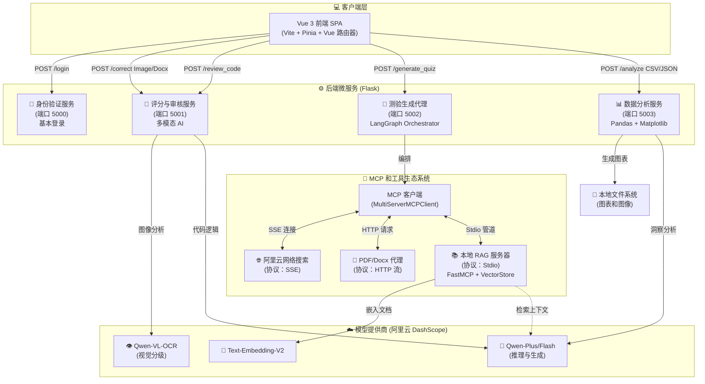

# Teacher Assistant (师小助) 

Empowering Education with Agentic AI

一个基于 LangChain、LangGraph 和 MCP 协议构建的全能型 AI 助教系统。

[](LICENSE)
[](https://www.python.org/)
[](https://vuejs.org/)
[](https://www.langchain.com/)
[](https://modelcontextprotocol.io/)

---

## ✨ 项目简介 (Introduction)

**Teacher Assistant (师小助)** 是一个现代化的教育辅助平台，旨在通过人工智能技术解放教师的生产力。

本项目采用**前后端分离**与**微服务架构**，深度集成了 [LangGraph](https://www.langchain.com/langgraph) 的工作流编排能力和 [Model Context Protocol (MCP)](https://modelcontextprotocol.io/) 的工具扩展能力。它不仅是一个简单的问答机器人，更是一个具备视觉识别、逻辑推理、代码审查和数据分析能力的智能体（Agent）。

核心能力包括利用 RAG 技术进行智能组卷、基于 Qwen-VL 的多模态作业批改、以及自动化的学情数据分析。

---

## 🚀 核心特性 (Key Features)

### 1. 🧠 智能组卷 (Agentic Quiz Generation)

基于 MCP Client 和 LangGraph 的高级编排：

- **智能路由**：自动判断意图，在「阿里云联网搜索」与「本地 RAG 知识库」间智能切换。

**本地 RAG**：通过 [FastMCP](https://modelcontextprotocol.io/fastmcp) 封装的本地知识库服务器，支持 LangChain 官方文档的精准检索 。

- **格式转换**：自动生成 Markdown 试卷，并调用 Agent 将其转换为 PDF 格式供下载。

### 2. 📝 智能批改 (Multimodal Grading)

利用 Qwen-VL-OCR 视觉大模型实现的自动化阅卷：

- **鹰眼识别**：精准提取手写试卷中的选项（A/B/C/D）和文字。

- **双流输入**：支持同时上传 `.docx` 标准答案与学生手写试卷图片。

- **结构化报告**：输出包含“成绩看板”、“逐题精批”和“深度建议”的 Markdown 报告。

### 3. 💻 代码智能审查 (AI Code Review)

专为编程教学设计的代码辅导工具：

- **多语言支持**：支持 Python, Java, C++, JavaScript 等主流语言。

- **深度分析**：提供问题诊断、代码修正（Diff 风格）以及性能优化建议。

- **灵活输入**：支持直接粘贴代码或上传源码文件。

### 4. 📊 学情数据分析 (Data Insight)

基于 Pandas 与 LLM 的数据洞察系统：

- **多维图表**：自动生成成绩趋势图、学科雷达图、进退步分析柱状图（Matplotlib）。

- **AI 顾问**：根据数据自动生成个性化的“短期/长期学习计划”及“生涯规划建议”。

- **多种数据源**：支持 Excel/CSV 导入或手动录入成绩。

---

## 🛠️ 技术栈 (Tech Stack)

### Backend (Python/Flask)

- **Framework**: Flask (Microservices on ports 5000-5004).

- **AI Orchestration**: LangChain, LangGraph.

**Protocol**: [Model Context Protocol (FastMCP)](https://modelcontextprotocol.io/).

- **LLM Services**: Aliyun DashScope (Qwen-Plus, Qwen-Flash, Qwen-VL).

- **Data Science**: Pandas, NumPy, Matplotlib.

### Frontend (Vue 3)

- **Core**: Vue 3 (Composition API, `<script setup>`).

- **State Management**: Pinia (User Store).

- **Routing**: Vue Router 4.

- **Styling**: Scoped CSS, Flexbox/Grid Layouts.

---

## 🏗️ 系统架构 (System Architecture)


## 📂 项目结构 (Project Structure)

项目目录树清晰展示各文件的归属与功能，帮助开发者快速定位核心代码：

```text

teacher-assistant/
├── backend/
│   ├── app.py                 # 用户认证服务 (Port 5000)
│   ├── 智能批改.py             # 视觉批改服务 (Port 5001)
│   ├── 代码批改.py             # 代码审查服务 (Port 5004)
│   ├── main.py                # 智能组卷主入口 (Port 5002)
│   ├── RAG_MCP.py             # 本地 RAG MCP 服务器
│   ├── data_analyzer.py       # 学情分析服务 (Port 5003)
│   └── requirements.txt
├── frontend/
│   ├── src/
│   │   ├── views/             # Vue 页面组件
│   │   └── ...
│   └── package.json
├── .env.example               # 环境变量示例文件
└── README.md
```

## 🏁 快速开始 (Getting Started)

### 前置要求

- Python 3.10+

- Node.js 16+

- 阿里云 DashScope API Key

### 1. 后端设置

```bash

# 克隆仓库
git clone https://github.com/abaiar/Teacher_Assistant_AI.git
cd teacher-assistant

# 创建并激活虚拟环境 (推荐)
conda create -n ai_assistant python=3.10
conda activate ai_assistant

# 安装依赖
pip install -r requirements.txt
```

配置环境变量

项目根目录下提供了 `.env.example` 文件。请复制并重命名为 `.env`，填入您的阿里云 API Key：

```bash

# .env 文件内容
DASHSCOPE_API_KEY=sk-xxxxxxxxxxxxxxxxxxxxxxxx
```

**注意**：请确保 `.gitignore` 中包含 `.env`，避免密钥泄露。若项目未自带 `.gitignore`，请手动添加并包含该规则。

```bash

export DASHSCOPE_API_KEY="sk-xxxxxxxxxxxxxxxx"
```

### 服务端口说明

|服务名称|端口|核心文件|功能描述|
|---|---|---|---|
|认证服务|5000|app.py|用户登录、鉴权|
|批改服务|5001|智能批改.py、代码批改.py|OCR 识别、作业批改、代码审查|
|组卷 Agent|5002|main.py|LangGraph 编排、MCP 工具调用|
|数据分析|5003|data_analyzer.py|成绩分析、图表生成|
启动微服务

由于项目采用微服务架构，需分别启动以下服务。推荐使用 `pm2` 或 `Supervisor` 管理进程（后续将支持 Docker Compose 一键启动）：

**Todo**：后续将提供 Docker Compose 配置文件，实现所有微服务一键启动。

```bash

# 终端 1: 用户认证服务 (Port 5000)
python app.py

# 终端 2: 智能批改服务 (Port 5001)
python 智能批改.py  

# 终端 3: 智能组卷 Agent (Port 5002)
# 注意：此服务会根据需要自动唤起 RAG_MCP.py 子进程
python main.py

# 终端 4: 数据分析服务 (Port 5003)
python data_analyzer.py

# 终端 5: 代码批改服务 (Port 5004)
python 代码批改.py
```

### 2. 前端设置

```bash

cd ../项目前端/src

# 安装依赖
npm install

# 启动开发服务器
npm run dev
```

访问 http://localhost:5173 (或 CLI 提示的端口) 即可看到系统界面。

## 📖 使用示例 (Usage Examples)

### 场景：生成一份关于“LangChain”的测试卷

1. 进入前端 "智能组卷" 页面。

2. 输入主题：LangChain 的核心概念与安装。

3. 点击 "开始智能组卷"。

后台运行逻辑：

1. main.py 接收请求，通过 MCP 协议唤起 LocalLangChainRAG 工具。

2. RAG_MCP.py 在本地向量库中检索文档，进行相关性评分 。

3. 如果文档不足，Agent 可能会自动切换到 WebSearch 工具搜索互联网。

4. LLM 生成 Markdown 试题，最后调用 PDF 工具生成下载链接。

### 场景：批改学生作业

1. 进入 "智能批改" 页面。

2. 上传标准答案 Word 文档 (.docx)。

3. 上传学生答卷照片 (.jpg/.png)。

系统将调用 Qwen-VL 视觉模型，自动比对并生成包含分数的详细报告。

## 🤝 贡献指南 (Contributing)

我们非常欢迎社区的贡献！如果您有好的想法：

1. Fork 本仓库。

2. 创建您的特性分支 (git checkout -b feature/AmazingFeature)

3. 提交您的更改 (git commit -m 'Add some AmazingFeature')

4. 推送到分支 (git push origin feature/AmazingFeature)

5. 提交 Pull Request

以下是项目的开发规划，清晰展示已完成功能与未来迭代方向：

- [x] 完成核心功能：组卷、批改、分析

- [x] 集成 MCP 协议与本地 RAG

- [ ] **Docker 化部署**：提供 Docker Compose 一键启动所有微服务

- [ ] **支持更多模型**：接入 DeepSeek、OpenAI 等模型

- [ ] **移动端适配**：开发移动端友好的 H5 界面

## 🗺️ 路线图 (Roadmap)

我们致力于将 **Teacher Assistant** 打造成最先进的开源 AI 助教平台。以下是我们未来的开发计划：

### ✅ v0.1: 核心功能 MVP (已完成)
- [x] **架构搭建**：基于 Flask 的微服务架构与 Vue 3 前端。
- [x] **智能组卷**：集成 LangGraph + MCP，实现联网搜索与本地 RAG 混合出题。
- [x] **多模态批改**：接入 Qwen-VL，支持手写试卷识别与语义评分。
- [x] **代码审查**：支持多语言代码分析与优化建议。
- [x] **数据分析**：基于 Pandas 的学情分析与 Matplotlib 图表生成。

### 🛠️ v0.2: 工程化与部署 (进行中)
- [ ] **Docker 化**：提供 `docker-compose.yml`，实现一键启动所有微服务（Auth, Grading, Quiz, Data）。
- [ ] **数据库持久化**：将当前 Mock 的用户系统迁移至 SQLite/MySQL，支持真正的用户注册与历史记录保存。
- [ ] **向量库升级**：将 `InMemoryVectorStore` 升级为 ChromaDB 或 Milvus，实现知识库持久化。
- [ ] **配置管理**：全面移除硬编码的 API Key，统一使用 `.env` 环境配置。

### 🤖 v0.3: 模型与工具扩展
- [ ] **本地大模型支持**：利用 Ollama/vLLM 接入 Llama 3、DeepSeek 等本地模型，降低 Token 成本。
- [ ] **MCP 工具生态**：
- [ ] 新增 `Calculator` 工具提高理科计算准确度。
- [ ] 新增 `Email` 工具支持一键发送分析报告给家长。
- [ ] **RAG 增强**：支持 PDF/Excel 文件批量上传并在本地建立索引。

### 💻 v1.0: 体验升级与多端适配
- [ ] **UI/UX 重构**：引入 Element Plus 或 Ant Design Vue，优化移动端响应式布局。
- [ ] **语音交互**：增加 STT/TTS 模块，支持口语考试模拟与语音指令。
- [ ] **班级管理系统**：增加教师端 Dashboard，支持批量导入学生名单与作业。

本项目基于 MIT 许可证开源 - 详情请参阅 LICENSE 文件。

Made with ❤️ by the Teacher Assistant Team.


