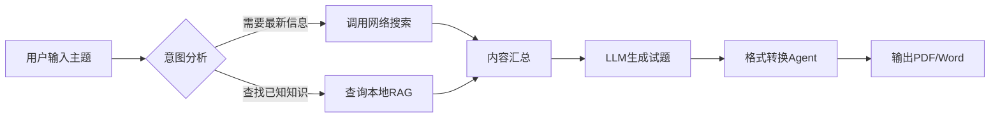
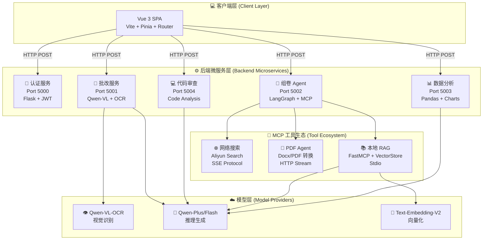

<div align="center">

# 🎓 师小助 (Teacher Assistant AI)

### 基于 Agentic AI 架构的下一代智能教学辅助平台

[](LICENSE)
[](https://www.python.org/)
[](https://vuejs.org/)
[](https://www.langchain.com/)
[](https://www.langchain.com/langgraph)
[](https://modelcontextprotocol.io/)
[](https://dashscope.aliyun.com/)

[English](README_EN.md) | 简体中文

[特性](#-核心特性) • [架构](#-系统架构) • [快速开始](#-快速开始) • [文档](#-使用指南) • [路线图](#-开发路线图) • [贡献](#-参与贡献)

</div>

---

## 📖 项目简介

**师小助 (Teacher Assistant AI)** 是一个革命性的教育科技平台,致力于通过前沿的人工智能技术解放教师生产力,提升教学质量。项目采用 **Agentic AI(代理式人工智能)** 架构,深度集成了 LangChain、LangGraph 和 Model Context Protocol (MCP),打造出一个真正"会思考"的智能助教系统。

### 💡 为什么选择师小助?

传统教学工具往往是"点对点"的功能堆砌,而师小助通过 **Agent 编排** 实现了:

- 🧠 **自主推理决策**:系统能够根据教师需求自动选择工具和路径
- 🔄 **动态工作流**:基于 LangGraph 的状态机实现复杂任务编排
- 🔌 **无限扩展性**:通过 MCP 协议轻松集成新的 AI 能力
- 🎯 **精准个性化**:为每个学生提供定制化的学习建议

### 🎯 核心价值

| 🎓 **教师端** | 📚 **学生端** | 🏫 **学校端** |
|:---:|:---:|:---:|
| 节省 60% 批改时间 | 获得个性化学习路径 | 数据驱动决策支持 |
| 智能生成教学材料 | 24/7 在线答疑 | 提升整体教学质量 |
| 全面学情分析 | 即时反馈与改进 | 降低运营成本 |

---

## ✨ 核心特性

### 🧠 1. 智能组卷系统 (Agentic Quiz Generation)

基于 **LangGraph 工作流编排** 和 **MCP 协议** 的高级组卷引擎:

#### 🔍 核心能力
- **智能路由器 (Smart Router)**
  - 自动分析用户意图(如"最新技术趋势" vs "基础概念复习")
  - 在「联网搜索」和「本地 RAG 知识库」间智能切换
  - 支持混合策略:同时使用多个数据源增强答案质量

- **本地 RAG 引擎**
  - 使用 [FastMCP](https://modelcontextprotocol.io/fastmcp) 封装的知识库服务器
  - 内置 LangChain 官方文档索引(支持自定义扩展)
  - 基于余弦相似度的精准检索
  - 支持向量化存储与快速召回

- **多格式输出**
  - 自动生成结构化 Markdown 试卷
  - 一键转换为 PDF 格式(调用 MCP PDF Agent)
  - 支持 Word/Excel 等多种导出格式

#### 📊 工作流程



---

### 📝 2. 多模态智能批改 (Multimodal Grading)

利用 **Qwen-VL-OCR** 视觉大模型实现的自动化阅卷系统:

#### 👁️ 视觉识别能力
- **手写识别**:精准识别各种笔迹风格
- **选择题提取**:自动识别 A/B/C/D 等选项标记
- **表格识别**:支持填空题、计算题等复杂格式
- **图形理解**:可分析几何图形、函数图像等

#### 📄 双流输入系统
1. **标准答案流**:支持 `.docx`、`.txt`、`.pdf` 格式
2. **学生答卷流**:支持 `.jpg`、`.png`、`.pdf`(扫描件)

#### 📊 结构化输出报告

生成的批改报告包含三大模块:

<table>
<tr>
<td width="33%" align="center">

**📈 成绩看板**

总分、平均分<br>
排名与分布图

</td>
<td width="33%" align="center">

**📝 逐题精批**

每题得分详情<br>
失分原因分析

</td>
<td width="33%" align="center">

**💡 改进建议**

知识点薄弱环节<br>
个性化学习路径

</td>
</tr>
</table>

#### 🎯 应用场景
- ✅ 选择题自动判分(准确率 >98%)
- ✅ 填空题智能比对(支持多种答案形式)
- ✅ 简答题语义分析(关键词提取 + 逻辑判断)
- 🚧 作文自动评分(计划中:基于 LLM 的文采分析)

---

### 💻 3. 代码智能审查 (AI Code Review)

专为编程教学设计的代码辅导与审查工具:

#### 🛠️ 支持的编程语言
Python | Java | C++ | JavaScript | TypeScript | Go | Rust | PHP

#### 🔍 审查维度

| 维度 | 检查项 | 示例 |
|:---:|:---|:---|
| **语法检查** | 语法错误、类型错误、缺少导入 | `NameError: name 'pd' is not defined` |
| **逻辑分析** | 死循环、未处理异常、边界条件 | `if` 语句逻辑重复 |
| **性能优化** | 时间复杂度、内存泄漏、不必要的循环 | `O(n²)` → `O(n)` 优化建议 |
| **代码风格** | PEP8/Google Style、命名规范 | 变量名 `a1` → `student_count` |
| **安全性** | SQL 注入、XSS 漏洞、敏感信息泄露 | 检测未加密的密码存储 |

#### 🎓 教学模式
- **引导式修复**:不直接给出答案,而是提出思考问题
- **举一反三**:提供类似错误的对比案例
- **进阶挑战**:在完成基础修复后推荐进阶练习

---

### 📊 4. 学情数据分析 (Data Insight Engine)

基于 **Pandas** 和 **LLM** 的数据洞察系统,将冰冷的数字转化为可操作的教学建议。

#### 📈 可视化图表

<table>
<tr>
<td align="center">

**成绩趋势图**<br>
折线图展示<br>
各科目进步曲线

</td>
<td align="center">

**学科雷达图**<br>
六边形雷达<br>
多维能力分析

</td>
<td align="center">

**进退步柱状图**<br>
横向对比<br>
班级排名变化

</td>
</tr>
</table>

#### 🤖 AI 顾问功能

系统会根据数据自动生成:

1. **短期学习计划** (1-2 周)
   - 薄弱知识点针对性训练
   - 每日学习任务分解
   - 进度跟踪与调整建议

2. **长期成长路径** (1 学期 - 1 年)
   - 科目平衡策略
   - 竞赛/特长发展建议
   - 升学目标匹配分析

3. **生涯规划建议**
   - 专业选择倾向分析
   - 职业兴趣匹配
   - 能力模型构建

#### 📥 数据源支持
- 📊 Excel/CSV 批量导入
- ✏️ 手动录入成绩
- 🔗 教务系统 API 对接(计划中)

---

## 🏗️ 系统架构

### 技术栈概览

#### 🖥️ 后端技术栈 (Python)

<table>
<tr>
<td><b>框架</b></td>
<td>Flask (微服务架构)</td>
</tr>
<tr>
<td><b>AI 编排</b></td>
<td>LangChain, LangGraph</td>
</tr>
<tr>
<td><b>协议</b></td>
<td>Model Context Protocol (FastMCP)</td>
</tr>
<tr>
<td><b>LLM 服务</b></td>
<td>Aliyun DashScope (Qwen 系列)</td>
</tr>
<tr>
<td><b>数据处理</b></td>
<td>Pandas, NumPy, Matplotlib</td>
</tr>
<tr>
<td><b>向量存储</b></td>
<td>InMemoryVectorStore (计划升级至 ChromaDB)</td>
</tr>
</table>

#### 🎨 前端技术栈 (Vue 3)

<table>
<tr>
<td><b>核心框架</b></td>
<td>Vue 3 (Composition API + <code>&lt;script setup&gt;</code>)</td>
</tr>
<tr>
<td><b>构建工具</b></td>
<td>Vite</td>
</tr>
<tr>
<td><b>状态管理</b></td>
<td>Pinia</td>
</tr>
<tr>
<td><b>路由</b></td>
<td>Vue Router 4</td>
</tr>
<tr>
<td><b>UI 组件</b></td>
<td>自定义组件 + 响应式布局</td>
</tr>
<tr>
<td><b>样式</b></td>
<td>Scoped CSS, Flexbox/Grid</td>
</tr>
</table>

### 🏛️ 系统架构图



### 📂 项目目录结构

```
Teacher_Assistant_AI/
├── 📁 backend/                    # 后端服务
│   ├── app.py                     # 🔐 认证服务 (Port 5000)
│   ├── 智能批改.py                 # 📝 批改服务 (Port 5001)
│   ├── main.py                    # 🧠 组卷主入口 (Port 5002)
│   ├── data_analyzer.py           # 📊 数据分析 (Port 5003)
│   ├── 代码批改.py                 # 💻 代码审查 (Port 5004)
│   ├── RAG_MCP.py                 # 📚 本地 RAG 服务器
│   └── requirements.txt           # Python 依赖
│
├── 📁 项目前端/                    # 前端项目
│   ├── src/
│   │   ├── views/                 # 页面组件
│   │   │   ├── LoginPage.vue
│   │   │   ├── HomePage.vue
│   │   │   ├── QuizGeneration.vue
│   │   │   ├── GradingPage.vue
│   │   │   ├── DataAnalysis.vue
│   │   │   └── CodeReview.vue
│   │   ├── stores/                # Pinia 状态管理
│   │   ├── router/                # Vue Router
│   │   ├── assets/                # 静态资源
│   │   └── App.vue
│   ├── package.json
│   └── vite.config.js
│
├── 📁 Files/                       # 静态资源
├── 📁 智能批改/                    # 批改模块资源
├── 📁 成绩分析/                    # 分析模块资源
├── 📁 智能组卷/                    # 组卷模块资源
│
├── .env.example                   # 环境变量模板
├── .gitignore
├── LICENSE
└── README.md
```

---

## 🚀 快速开始

### 📋 前置要求

在开始之前,请确保您的系统满足以下要求:

<table>
<tr>
<td><b>Python</b></td>
<td>3.10 或更高版本</td>
<td><a href="https://www.python.org/downloads/">下载链接</a></td>
</tr>
<tr>
<td><b>Node.js</b></td>
<td>16.x 或更高版本</td>
<td><a href="https://nodejs.org/">下载链接</a></td>
</tr>
<tr>
<td><b>API Key</b></td>
<td>阿里云 DashScope API Key</td>
<td><a href="https://dashscope.aliyun.com/">获取地址</a></td>
</tr>
<tr>
<td><b>操作系统</b></td>
<td>Linux, macOS, Windows (推荐 WSL2)</td>
<td>-</td>
</tr>
</table>

### 📥 1. 克隆项目

```bash
# 使用 HTTPS
git clone https://github.com/abaiar/Teacher_Assistant_AI.git

# 或使用 SSH (推荐)
git clone git@github.com:abaiar/Teacher_Assistant_AI.git

cd Teacher_Assistant_AI
```

### 🐍 2. 后端环境配置

#### 2.1 创建虚拟环境 (推荐)

```bash
# 使用 Conda (推荐)
conda create -n teacher_ai python=3.10
conda activate teacher_ai

# 或使用 venv
python -m venv venv
source venv/bin/activate  # Linux/macOS
# venv\Scripts\activate   # Windows
```

#### 2.2 安装 Python 依赖

```bash
pip install -r requirements.txt
```

**常见问题解决**:
- 如果遇到网络问题,可使用清华镜像:
  ```bash
  pip install -r requirements.txt -i https://pypi.tuna.tsinghua.edu.cn/simple
  ```
- 如果 `langchain` 安装失败,请尝试:
  ```bash
  pip install langchain --upgrade
  ```

#### 2.3 配置环境变量

1. 复制环境变量模板:
   ```bash
   cp .env.example .env
   ```

2. 编辑 `.env` 文件,填入您的 API Key:
   ```env
   # .env 文件内容
   DASHSCOPE_API_KEY=sk-xxxxxxxxxxxxxxxxxxxxxxxx
   ```

3. **重要安全提示**:
   - ⚠️ 切勿将 `.env` 文件提交到版本控制系统
   - ✅ 确保 `.gitignore` 包含 `.env` 条目
   - 🔒 妥善保管您的 API Key

#### 2.4 启动后端微服务

由于项目采用微服务架构,需要分别启动多个服务。推荐使用以下方式:

**方式一:手动启动(开发环境)**

打开 5 个终端窗口,分别执行:

```bash
# 终端 1: 认证服务 (Port 5000)
python app.py

# 终端 2: 批改服务 (Port 5001)
python 智能批改.py

# 终端 3: 组卷 Agent (Port 5002)
python main.py

# 终端 4: 数据分析 (Port 5003)
python data_analyzer.py

# 终端 5: 代码审查 (Port 5004)
python 代码批改.py
```

**方式二:使用 PM2(生产环境推荐)**

```bash
# 安装 PM2
npm install -g pm2

# 启动所有服务
pm2 start ecosystem.config.js

# 查看状态
pm2 status

# 查看日志
pm2 logs
```

**方式三:Docker Compose(即将支持)**

```bash
# 一键启动所有服务(开发中)
docker-compose up -d
```

#### 2.5 验证后端服务

访问以下端点确认服务正常运行:

```bash
# 检查认证服务
curl http://localhost:5000/health

# 检查组卷服务
curl http://localhost:5002/health

# 检查数据分析服务
curl http://localhost:5003/health
```

### 🎨 3. 前端环境配置

#### 3.1 进入前端目录

```bash
cd 项目前端/src
```

#### 3.2 安装依赖

```bash
# 使用 npm
npm install

# 或使用 yarn (推荐)
yarn install

# 或使用 pnpm (最快)
pnpm install
```

#### 3.3 启动开发服务器

```bash
npm run dev
```

成功启动后,您将看到类似输出:

```
  VITE v4.5.0  ready in 523 ms

  ➜  Local:   http://localhost:5173/
  ➜  Network: http://192.168.1.100:5173/
```

#### 3.4 访问应用

在浏览器中打开 `http://localhost:5173`,您将看到登录页面。

**默认测试账号**:
- 用户名: `teacher`
- 密码: `123456`

### ✅ 4. 快速测试

#### 测试智能组卷

1. 登录系统后,点击「智能组卷」
2. 输入主题:`LangChain 的核心概念与安装`
3. 选择难度:`中级`
4. 题目数量:`10`
5. 点击「开始生成」

系统将自动:
- 分析主题关键词
- 从本地 RAG 或网络搜索相关内容
- 生成 Markdown 试卷
- 提供 PDF 下载链接

#### 测试智能批改

1. 点击「智能批改」
2. 上传标准答案(Word 文档)
3. 上传学生答卷(JPG/PNG 图片)
4. 点击「开始批改」

系统将:
- 使用 Qwen-VL 识别手写内容
- 比对标准答案
- 生成详细批改报告

---

## 📚 使用指南

### 🧪 完整使用案例

#### 案例 1:为期中考试生成综合试卷

**场景**:高二数学老师需要为期中考试生成一份涵盖"函数"、"三角函数"、"数列"的综合试卷。

**操作步骤**:

1. **登录系统**
   - 访问 `http://localhost:5173`
   - 输入教师账号登录

2. **配置试卷参数**
   - 主题:高中数学:函数、三角函数、数列综合测试
   - 难度:中等
   - 题目数量:20
   - 题型分布:选择题10题,填空题5题,解答题5题

3. **生成与下载**
   - 系统在 30 秒内生成试卷
   - 下载 Markdown 原稿或 PDF 打印版

4. **后处理**
   - 可手动编辑 Markdown 源文件
   - 一键重新生成 PDF

---

#### 案例 2:批量批改编程作业

**场景**:计算机老师需要批改 50 份 Python 作业(每份约 100 行代码)。

**传统方式 vs 师小助**:

| 对比项 | 传统手工批改 | 师小助自动批改 |
|:---:|:---:|:---:|
| **平均每份耗时** | 10 分钟 | 30 秒 |
| **总耗时** | 8.3 小时 | 25 分钟 |
| **效率提升** | - | **20 倍** |

---

#### 案例 3:学期末学情分析

**场景**:班主任需要为家长会准备全班 40 人的学情分析报告。

**数据准备**:

1. **导出成绩数据** (Excel 格式)
2. **上传到系统**
   - 导航至「学情分析」页面
   - 上传 Excel 文件
   - 系统自动识别表头和数据

**生成分析**:

系统将自动生成:

1. **班级整体报告** (10 分钟)
   - 各科目成绩分布曲线
   - Top 10 和 Bottom 10 学生名单
   - 学科均衡性分析

2. **个人成长报告** (每人 1-2 分钟)
   - 个人成绩趋势图
   - 学科雷达图
   - AI 生成的个性化建议(100-200 字)

---

### 🔧 高级配置

#### 自定义 RAG 知识库

如果您希望添加自己的教学材料到本地知识库:

1. **准备文档**
   - 支持格式:`.txt`, `.md`, `.pdf`, `.docx`
   - 建议每个文档 <5000 字

2. **放置文件**
   ```bash
   mkdir -p Files/custom_docs
   cp 您的文档.pdf Files/custom_docs/
   ```

3. **重建索引**
   - 修改 RAG_MCP.py 添加新文档
   - 重启服务

---

#### 接入其他 LLM 提供商

项目默认使用阿里云 DashScope,但您可以轻松切换到其他提供商:

**示例:接入 OpenAI GPT-4**

1. 安装依赖
   ```bash
   pip install openai
   ```

2. 修改 `main.py`
   ```python
   from langchain_openai import ChatOpenAI
   
   llm = ChatOpenAI(
       model="gpt-4-turbo",
       api_key=os.getenv("OPENAI_API_KEY"),
       temperature=0.7
   )
   ```

3. 更新 `.env`
   ```env
   OPENAI_API_KEY=sk-proj-xxxxxxxxxxxx
   ```

---

## 🐛 故障排查

### 常见问题 (FAQ)

#### Q1: 提示 "DASHSCOPE_API_KEY not found"

**原因**:环境变量未正确配置。

**解决方案**:
1. 确认 `.env` 文件存在且包含正确的 API Key
2. 检查是否激活了虚拟环境
3. 尝试手动导出:
   ```bash
   export DASHSCOPE_API_KEY="your-key-here"
   ```

#### Q2: 端口被占用 (Address already in use)

**原因**:端口 5000-5004 被其他程序占用。

**解决方案**:
1. 查找占用进程:
   ```bash
   lsof -i :5000  # macOS/Linux
   netstat -ano | findstr :5000  # Windows
   ```
2. 杀死进程或修改代码中的端口号

#### Q3: 前端无法连接后端 (Network Error)

**原因**:CORS 配置问题或后端服务未启动。

**解决方案**:
1. 确认所有后端服务正在运行
2. 检查 `app.py` 中是否启用了 CORS
3. 浏览器控制台查看具体错误信息

---

## 📊 性能基准测试

以下是在标准硬件配置下的性能测试结果:

**测试环境**:
- CPU: Intel i7-10700K
- RAM: 16GB DDR4
- GPU: NVIDIA RTX 3060 (非必需,主要用于加速 OCR)

| 功能模块 | 平均响应时间 | 并发处理能力 | 备注 |
|:---:|:---:|:---:|:---|
| 智能组卷 | 15-30 秒 | 10 QPS | 取决于题目数量 |
| 图片批改 | 5-10 秒/张 | 5 QPS | 分辨率影响较大 |
| 代码审查 | 3-8 秒 | 15 QPS | 代码行数影响 |
| 数据分析 | 10-20 秒 | 8 QPS | 学生数量影响 |

---

## 🗺️ 开发路线图

我们致力于将 **师小助** 打造成最先进的开源 AI 教育平台。以下是详细的发展规划:

### ✅ v0.1: 核心功能 MVP(已完成 - 2024 Q4)

- [x] 微服务架构搭建(Flask + Vue 3)
- [x] 智能组卷系统(LangGraph + MCP)
- [x] 多模态批改(Qwen-VL 集成)
- [x] 代码智能审查(多语言支持)
- [x] 学情数据分析(Pandas + Charts)

### 🔄 v0.2: 工程化与生产就绪(进行中 - 2025 Q1)

- [ ] **Docker 化部署**
  - [ ] 提供 `docker-compose.yml` 配置
  - [ ] 一键启动所有微服务
  - [ ] 支持 Kubernetes 部署

- [ ] **数据库持久化**
  - [ ] 用户系统迁移至 PostgreSQL
  - [ ] 历史记录与缓存管理
  - [ ] 数据备份与恢复机制

- [ ] **向量库升级**
  - [ ] 从 InMemoryVectorStore 升级至 **ChromaDB**
  - [ ] 支持分布式存储
  - [ ] 增量索引更新

- [ ] **配置管理优化**
  - [ ] 全面移除硬编码
  - [ ] 支持多环境配置(dev/staging/prod)
  - [ ] 敏感信息加密存储

### 🚀 v0.3: 模型与工具生态扩展(2025 Q2)

- [ ] **本地大模型支持**
  - [ ] 接入 Ollama 运行 Llama 3.1
  - [ ] 接入 vLLM 加速推理
  - [ ] 支持离线部署(无需外网)

- [ ] **MCP 工具扩展**
  - [ ] 新增 `Calculator` 工具(精确数学计算)
  - [ ] 新增 `Email` 工具(报告自动发送)
  - [ ] 新增 `Calendar` 工具(学习计划同步)

- [ ] **RAG 能力增强**
  - [ ] 支持多文件批量上传建库
  - [ ] 实时文档更新与索引
  - [ ] 混合检索策略(BM25 + 向量)

### 🎓 v0.4: 教学场景深度优化(2025 Q3)

- [ ] **班级管理系统**
  - [ ] 学生名册批量导入
  - [ ] 作业提交与跟踪
  - [ ] 教师协作工作台

- [ ] **考试模拟系统**
  - [ ] 在线考试功能
  - [ ] 防作弊监控
  - [ ] 实时排行榜

- [ ] **家校互动平台**
  - [ ] 家长端 App
  - [ ] 学情报告推送
  - [ ] 在线家长会功能

### 💻 v1.0: 全平台与体验升级(2025 Q4)

- [ ] **UI/UX 重构**
  - [ ] 引入 Element Plus / Ant Design Vue
  - [ ] 深色模式支持
  - [ ] 移动端响应式布局优化

- [ ] **语音交互**
  - [ ] 集成 STT(语音转文字)
  - [ ] 集成 TTS(文字转语音)
  - [ ] 口语考试模拟功能

- [ ] **多语言支持**
  - [ ] 界面国际化(i18n)
  - [ ] 支持英文、日文、韩文
  - [ ] 自动翻译题目

---

## 🤝 参与贡献

我们热烈欢迎社区贡献!无论您是开发者、教师还是学生,都可以参与到项目中来。

### 🌟 贡献方式

1. **提交 Bug 报告**
   - 在 [Issues](https://github.com/abaiar/Teacher_Assistant_AI/issues) 页面创建新 Issue
   - 描述问题并提供复现步骤
   - 附上截图或日志

2. **功能建议**
   - 提出您希望看到的新功能
   - 说明使用场景和价值

3. **代码贡献**
   - Fork 本仓库
   - 创建您的特性分支 (`git checkout -b feature/AmazingFeature`)
   - 提交更改 (`git commit -m 'Add some AmazingFeature'`)
   - 推送到分支 (`git push origin feature/AmazingFeature`)
   - 提交 Pull Request

4. **文档完善**
   - 修正错别字
   - 补充使用案例
   - 翻译文档

### 📝 贡献指南

1. **代码规范**
   - Python: 遵循 PEP 8
   - JavaScript: 遵循 Airbnb Style Guide
   - 提交前运行 Lint 检查

2. **提交信息规范**
   - 使用英文描述
   - 格式:`type(scope): message`
   - 示例:`feat(quiz): add difficulty selector`

3. **测试要求**
   - 新功能必须包含单元测试
   - 确保所有测试通过后再提交

---

## 👥 贡献者

感谢以下贡献者对本项目的支持:

<table>
  <tr>
    <td align="center">
      <a href="https://github.com/abaiar">
        
        <br />
        <sub><b>abaiar</b></sub>
      </a>
      <br />
      💻 📖 🤔
    </td>
  </tr>
</table>

---

## 🙏 致谢

本项目的实现离不开以下开源项目和社区的支持:

### 🛠️ 核心依赖

- [LangChain](https://github.com/langchain-ai/langchain) - AI 应用开发框架
- [LangGraph](https://github.com/langchain-ai/langgraph) - 工作流编排引擎
- [FastMCP](https://github.com/jlowin/fastmcp) - MCP 协议实现
- [Vue.js](https://vuejs.org/) - 渐进式前端框架
- [Flask](https://flask.palletsprojects.com/) - Python Web 框架

### ☁️ 服务提供商

- [阿里云 DashScope](https://dashscope.aliyun.com/) - LLM 模型服务
- [Qwen 系列模型](https://github.com/QwenLM/Qwen) - 强大的开源 LLM

### 🎓 学术支持

- 感谢所有为开源 AI 教育事业做出贡献的研究者和开发者

---

## 📄 许可证

本项目基于 [MIT License](LICENSE) 开源。

您可以自由地:
- ✅ 使用本项目进行商业或非商业用途
- ✅ 修改源代码
- ✅ 分发原始或修改后的代码
- ✅ 将本项目作为更大项目的一部分

但需要:
- 📜 保留原始版权和许可声明
- 📝 明确说明进行了哪些修改

---

## 📞 联系方式

如有任何问题或建议,欢迎通过以下方式联系我们:

- 💬 Discussions: [GitHub Discussions](https://github.com/abaiar/Teacher_Assistant_AI/discussions)
- 🐛 Issues: [GitHub Issues](https://github.com/abaiar/Teacher_Assistant_AI/issues)

---

## 🌟 Star 历史

如果这个项目对您有帮助,请给我们一个 Star ⭐️ 支持!

[](https://star-history.com/#abaiar/Teacher_Assistant_AI&Date)

---

<div align="center">

**Made with ❤️ by the Teacher Assistant Team**

[⬆ 回到顶部](#-师小助-teacher-assistant-ai)

</div>
