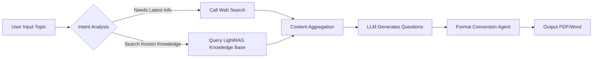
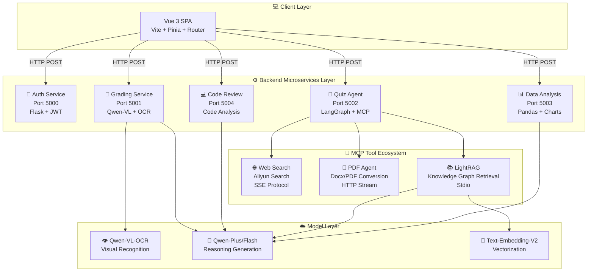

<div align="center">

# 🎓 Teacher Assistant AI (师小助)

### Next-Generation Intelligent Teaching Assistant Platform Based on Agentic AI Architecture

[](LICENSE)
[](https://www.python.org/)
[](https://vuejs.org/)
[](https://www.langchain.com/)
[](https://www.langchain.com/langgraph)
[](https://modelcontextprotocol.io/)
[](https://dashscope.aliyun.com/)

English | [简体中文](README.md)

[Features](#-core-features) • [Architecture](#-system-architecture) • [Quick Start](#-quick-start) • [Documentation](#-project-documentation) • [Contributing](#-contributing)

</div>

---

## 📖 Project Overview

**Teacher Assistant AI (师小助)** is a revolutionary educational technology platform dedicated to liberating teacher productivity and improving teaching quality through cutting-edge artificial intelligence technologies. The project adopts an **Agentic AI** architecture, deeply integrating LangChain, LangGraph, LightRAG, and Model Context Protocol (MCP) to create a truly "thinking" intelligent teaching assistant system.

### 💡 Why Choose Teacher Assistant AI?

Unlike traditional teaching tools that often consist of "point-to-point" feature堆砌, Teacher Assistant AI achieves the following through **Agent Orchestration**:

- 🧠 **Autonomous Reasoning & Decision Making**: The system can automatically select tools and paths based on teacher requirements
- 🔄 **Dynamic Workflows**: Complex task orchestration based on LangGraph state machines
- 🔌 **Infinite Extensibility**: Easy integration of new AI capabilities through the MCP protocol
- 🎯 **Precise Personalization**: Customized learning recommendations for each student
- 📚 **Knowledge Graph Support**: Deep semantic retrieval based on LightRAG knowledge base

### 🎯 Core Value

| 🎓 **For Teachers** | 📚 **For Students** | 🏫 **For Schools** |
|:---:|:---:|:---:|
| Save 60% grading time | Get personalized learning paths | Data-driven decision support |
| Intelligent teaching material generation | 24/7 online Q&A | Improve overall teaching quality |
| Comprehensive learning analytics | Instant feedback & improvement | Reduce operational costs |

---

## ✨ Core Features

### 🧠 1. Intelligent Quiz Generation System (Agentic Quiz Generation)

An advanced quiz generation engine based on **LangGraph workflow orchestration**, **LightRAG knowledge graph**, and **MCP protocol**:

#### 🔍 Core Capabilities
- **Smart Router**
  - Automatically analyzes user intent (e.g., "latest tech trends" vs "basic concept review")
  - Intelligently switches between "web search" and "local RAG knowledge base"
  - Supports hybrid strategies: using multiple data sources simultaneously to enhance answer quality

- **LightRAG Knowledge Graph Engine**
  - Uses [LightRAG](https://github.com/HKUDS/LightRAG) to build knowledge graphs
  - Supports multiple retrieval modes: local, global, hybrid, mix, and naive
  - Deep semantic association retrieval based on graph structure
  - Supports vectorized storage and fast recall

- **MCP Tool Ecosystem**
  - Knowledge base server encapsulated based on FastMCP
  - Standardized tool calling interfaces
  - Supports web search, PDF conversion, and other tools

- **Multi-format Output**
  - Automatically generates structured Markdown quizzes
  - One-click conversion to PDF format
  - Supports Word/Excel and other export formats

#### 📊 Workflow



---

### 📝 2. Multimodal Intelligent Grading (Multimodal Grading)

An automated grading system utilizing **Qwen-VL-OCR** visual large models:

#### 👁️ Visual Recognition Capabilities
- **Handwriting Recognition**: Accurately recognizes various handwriting styles
- **Multiple Choice Extraction**: Automatically identifies A/B/C/D option markings
- **Table Recognition**: Supports complex formats like fill-in-the-blank and calculation questions
- **Graphics Understanding**: Can analyze geometric figures, function graphs, etc.

#### 📄 Dual-Stream Input System
1. **Standard Answer Stream**: Supports `.docx`, `.txt`, `.pdf` formats
2. **Student Answer Stream**: Supports `.jpg`, `.png`, `.pdf` (scanned documents)

#### 📊 Structured Output Reports

Generated grading reports include three main modules:

<table>
<tr>
<td width="33%" align="center">

**📈 Score Dashboard**

Total score, average score<br>
Ranking and distribution charts

</td>
<td width="33%" align="center">

**📝 Detailed Grading**

Score details for each question<br>
Analysis of point loss reasons

</td>
<td width="33%" align="center">

**💡 Improvement Suggestions**

Weak knowledge points<br>
Personalized learning paths

</td>
</tr>
</table>

#### 🎯 Application Scenarios
- ✅ Automatic multiple-choice grading (accuracy >98%)
- ✅ Intelligent fill-in-the-blank comparison (supports multiple answer formats)
- ✅ Short answer semantic analysis (keyword extraction + logic judgment)
- 🚧 Essay automatic scoring (planned: LLM-based writing quality analysis)

---

### 💻 3. Intelligent Code Review (AI Code Review)

A code tutoring and review tool designed specifically for programming education:

#### 🛠️ Supported Programming Languages
Python | Java | C++ | JavaScript | TypeScript | Go | Rust | PHP

#### 🔍 Review Dimensions

| Dimension | Check Items | Example |
|:---:|:---|:---|
| **Syntax Check** | Syntax errors, type errors, missing imports | `NameError: name 'pd' is not defined` |
| **Logic Analysis** | Infinite loops, unhandled exceptions, boundary conditions | Duplicate `if` statement logic |
| **Performance Optimization** | Time complexity, memory leaks, unnecessary loops | `O(n²)` → `O(n)` optimization suggestions |
| **Code Style** | PEP8/Google Style, naming conventions | Variable name `a1` → `student_count` |
| **Security** | SQL injection, XSS vulnerabilities, sensitive info leakage | Detect unencrypted password storage |

#### 🎓 Teaching Mode
- **Guided Repair**: Doesn't directly give answers, but poses thinking questions
- **Learn by Analogy**: Provides comparison cases of similar errors
- **Advanced Challenges**: Recommends advanced exercises after basic fixes

---

### 📊 4. Learning Analytics Engine (Data Insight Engine)

A data insight system based on **Pandas** and **LLM** that transforms cold numbers into actionable teaching recommendations.

#### 📈 Visualization Charts

<table>
<tr>
<td align="center">

**Score Trend Chart**<br>
Line chart showing<br>
Progress curves for each subject

</td>
<td align="center">

**Subject Radar Chart**<br>
Hexagonal radar<br>
Multi-dimensional ability analysis

</td>
<td align="center">

**Progress/Regression Bar Chart**<br>
Horizontal comparison<br>
Class ranking changes

</td>
</tr>
</table>

#### 🤖 AI Advisor Features

The system automatically generates based on data:

1. **Short-term Learning Plan** (1-2 weeks)
   - Targeted training for weak knowledge points
   - Daily learning task breakdown
   - Progress tracking and adjustment suggestions

2. **Long-term Growth Path** (1 semester - 1 year)
   - Subject balance strategies
   - Competition/specialty development suggestions
   - College entrance goal matching analysis

3. **Career Planning Suggestions**
   - Major selection tendency analysis
   - Career interest matching
   - Competency model building

#### 📥 Data Source Support
- 📊 Excel/CSV batch import
- ✏️ Manual score entry
- 🔗 Educational system API integration (planned)

---

## 🏗️ System Architecture

### Technology Stack Overview

#### 🖥️ Backend Technology Stack (Python)

<table>
<tr>
<td><b>Framework</b></td>
<td>Flask (Microservices Architecture)</td>
</tr>
<tr>
<td><b>AI Orchestration</b></td>
<td>LangChain, LangGraph</td>
</tr>
<tr>
<td><b>Knowledge Graph</b></td>
<td>LightRAG</td>
</tr>
<tr>
<td><b>Protocol</b></td>
<td>Model Context Protocol (FastMCP)</td>
</tr>
<tr>
<td><b>LLM Service</b></td>
<td>Aliyun DashScope (Qwen Series)</td>
</tr>
<tr>
<td><b>Data Processing</b></td>
<td>Pandas, NumPy, Matplotlib</td>
</tr>
<tr>
<td><b>Vector Storage</b></td>
<td>LightRAG Built-in Storage</td>
</tr>
</table>

#### 🎨 Frontend Technology Stack (Vue 3)

<table>
<tr>
<td><b>Core Framework</b></td>
<td>Vue 3 (Composition API + <code>&lt;script setup&gt;</code>)</td>
</tr>
<tr>
<td><b>Build Tool</b></td>
<td>Vite</td>
</tr>
<tr>
<td><b>State Management</b></td>
<td>Pinia</td>
</tr>
<tr>
<td><b>Routing</b></td>
<td>Vue Router 4</td>
</tr>
<tr>
<td><b>UI Components</b></td>
<td>Custom Components + Responsive Layout</td>
</tr>
<tr>
<td><b>HTTP Client</b></td>
<td>Axios</td>
</tr>
<tr>
<td><b>Styling</b></td>
<td>Scoped CSS, Flexbox/Grid</td>
</tr>
</table>

### 🏛️ System Architecture Diagram



### 📂 Project Directory Structure

```
Teacher_Assistant_AI/
├── 📁 backend/                    # Backend Services
│   ├── 📁 Achievement_analysis/   # Learning Analytics Module
│   │   ├── data_analyzer.py       # Data Analysis Service (Port 5003)
│   │   └── requirements.txt
│   │
│   ├── 📁 Code_correction/        # Code Review Module
│   │   └── Code_correction.py     # Code Review Service (Port 5004)
│   │
│   ├── 📁 Login/                  # Authentication Module
│   │   └── login.py               # Auth Service (Port 5000)
│   │
│   ├── 📁 Paper_composition/      # Intelligent Quiz Module
│   │   ├── main.py                # Quiz Main Entry (Port 5002)
│   │   ├── RAG_MCP_LightRAG.py    # LightRAG MCP Server
│   │   ├── lightrag_config.py     # LightRAG Configuration
│   │   └── lightrag_storage/      # LightRAG Knowledge Base Storage
│   │
│   ├── 📁 Paper_marking/          # Intelligent Grading Module
│   │   └── marking.py             # Grading Service (Port 5001)
│   │
│   ├── 📁 logs/                   # Log Storage
│   │   └── lightrag.log           # LightRAG Runtime Logs
│   │
│   ├── main.py                    # Service Launcher
│   └── requirements.txt           # Python Dependencies
│
├── 📁 frontend/                   # Frontend Project
│   ├── src/
│   │   ├── views/                 # Page Components
│   │   │   ├── LoginPage.vue
│   │   │   ├── HomePage.vue
│   │   │   ├── QuizGeneration.vue
│   │   │   ├── GradingPage.vue
│   │   │   ├── DataAnalysis.vue
│   │   │   └── CodeReview.vue
│   │   ├── stores/                # Pinia State Management
│   │   ├── router/                # Vue Router
│   │   ├── assets/                # Static Resources
│   │   └── App.vue
│   ├── package.json
│   └── vite.config.js
│
├── 📁 Files/                       # Static Resources
├── 📁 智能批改/                    # Grading Module Resources
├── 📁 成绩分析/                    # Analysis Module Resources
├── 📁 智能组卷/                    # Quiz Module Resources
│
├── .env.example                   # Environment Variables Template
├── .gitignore                     # Git Ignore Configuration
├── LICENSE                        # License
└── README.md                      # Project Documentation
```

---

## 🚀 Quick Start

### 📋 Prerequisites

Before starting, ensure your system meets the following requirements:

<table>
<tr>
<td><b>Python</b></td>
<td>3.10 or higher</td>
<td><a href="https://www.python.org/downloads/">Download</a></td>
</tr>
<tr>
<td><b>Node.js</b></td>
<td>16.x or higher</td>
<td><a href="https://nodejs.org/">Download</a></td>
</tr>
<tr>
<td><b>API Key</b></td>
<td>Aliyun DashScope API Key</td>
<td><a href="https://dashscope.aliyun.com/">Get Key</a></td>
</tr>
<tr>
<td><b>Operating System</b></td>
<td>Windows, Linux, macOS</td>
<td>-</td>
</tr>
</table>

### 📥 1. Clone the Project

```bash
# Using HTTPS
git clone https://github.com/abaiar/Teacher_Assistant_AI.git

# Or using SSH (recommended)
git clone git@github.com:abaiar/Teacher_Assistant_AI.git

cd Teacher_Assistant_AI
```

### 🐍 2. Backend Environment Setup

#### 2.1 Create Virtual Environment (Recommended)

```bash
# Using Conda (recommended)
conda create -n teacher_ai python=3.10
conda activate teacher_ai

# Or using venv
python -m venv venv
# Windows:
venv\Scripts\activate
# Linux/macOS:
source venv/bin/activate
```

#### 2.2 Install Python Dependencies

```bash
pip install -r backend/requirements.txt
```

**Troubleshooting**:
- If you encounter network issues, use Tsinghua mirror:
  ```bash
  pip install -r backend/requirements.txt -i https://pypi.tuna.tsinghua.edu.cn/simple
  ```

#### 2.3 Configure Environment Variables

1. Copy the environment variables template:
   ```bash
   cp .env.example .env
   ```

2. Edit the `.env` file and add your API Key:
   ```env
   # .env file content
   DASHSCOPE_API_KEY=sk-xxxxxxxxxxxxxxxxxxxxxxxx
   ```

3. **Important Security Notes**:
   - ⚠️ Never commit the `.env` file to version control
   - ✅ Ensure `.gitignore` includes `.env` entry
   - 🔒 Keep your API Key secure

#### 2.4 Start Backend Services

**Option 1: Using Main Launcher (Recommended)**

```bash
cd backend
python main.py
```

The main launcher will automatically start all microservices:
- Auth Service (Port 5000)
- Grading Service (Port 5001)
- Quiz Service (Port 5002)
- Data Analysis Service (Port 5003)
- Code Review Service (Port 5004)

**Option 2: Manual Start (Development/Debugging)**

Open multiple terminal windows and execute:

```bash
# Terminal 1: Auth Service (Port 5000)
python backend/Login/login.py

# Terminal 2: Grading Service (Port 5001)
python backend/Paper_marking/marking.py

# Terminal 3: Quiz Service (Port 5002)
python backend/Paper_composition/main.py

# Terminal 4: Data Analysis Service (Port 5003)
python backend/Achievement_analysis/data_analyzer.py

# Terminal 5: Code Review Service (Port 5004)
python backend/Code_correction/Code_correction.py
```

#### 2.5 Verify Backend Services

Visit the following endpoints to confirm services are running:

```bash
# Check quiz service
curl http://localhost:5002/health

# Check data analysis service
curl http://localhost:5003/health
```

### 🎨 3. Frontend Environment Setup

#### 3.1 Enter Frontend Directory

```bash
cd frontend
```

#### 3.2 Install Dependencies

```bash
# Using npm
npm install

# Or using yarn
yarn install

# Or using pnpm
pnpm install
```

#### 3.3 Start Development Server

```bash
npm run dev
```

After successful startup, you will see output similar to:

```
  VITE v6.0.5  ready in 523 ms

  ➜  Local:   http://localhost:5173/
  ➜  Network: http://192.168.1.100:5173/
```

#### 3.4 Access the Application

Open `http://localhost:5173` in your browser to see the login page.

**Default Test Account**:
- Username: `teacher`
- Password: `123456`

---

## 📚 Project Documentation

### 🧪 Usage Examples

#### Example 1: Generate Comprehensive Quiz

**Scenario**: A math teacher needs to generate a comprehensive midterm exam covering "functions", "trigonometric functions", and "sequences".

**Steps**:

1. **Login to System**
   - Visit `http://localhost:5173`
   - Enter teacher account credentials

2. **Configure Quiz Parameters**
   - Topic: High School Math: Functions, Trigonometry, Sequences Comprehensive Test
   - Difficulty: Medium
   - Number of Questions: 20
   - Question Distribution: 10 multiple choice, 5 fill-in-the-blank, 5 problem-solving

3. **Generate and Download**
   - System generates quiz within 30 seconds
   - Download Markdown source or PDF printable version

#### Example 2: Batch Grading Programming Assignments

**Scenario**: A computer science teacher needs to grade 50 Python assignments.

**Efficiency Comparison**:

| Comparison Item | Traditional Manual Grading | Teacher Assistant AI |
|:---:|:---:|:---:|
| **Average Time per Assignment** | 10 minutes | 30 seconds |
| **Total Time** | 8.3 hours | 25 minutes |
| **Efficiency Improvement** | - | **20x** |

#### Example 3: Learning Analytics

**Scenario**: A class teacher needs to prepare learning analytics reports for 40 students for a parent-teacher conference.

**Steps**:

1. **Export Grade Data** (Excel format)
2. **Upload to System**
   - Navigate to "Learning Analytics" page
   - Upload Excel file
   - System automatically recognizes headers and data
3. **Generate Analysis Report**
   - Class overall report (grade distribution, ranking analysis)
   - Individual growth report (trend charts, radar charts, AI recommendations)

---

### 🔧 Advanced Configuration

#### Custom LightRAG Knowledge Base

If you want to add your own teaching materials to the knowledge base:

1. **Prepare Documents**
   - Supported formats: `.txt`, `.md`, `.pdf`, `.docx`
   - Recommended: each document <5000 words

2. **Call Insert Interface**
   ```python
   # Use LightRAG MCP tool to insert documents
   await insert_document("Your document content", "Document Title")
   ```

3. **Verify Retrieval**
   - Use query interface to test knowledge base retrieval
   - Supports multiple retrieval modes: local, global, hybrid, mix, naive

#### Configure Log Path

LightRAG logs are stored in `backend/logs/lightrag.log` by default. To modify:

Edit `backend/Paper_composition/RAG_MCP_LightRAG.py`:

```python
# Modify log directory
log_dir = Path(__file__).parent.parent / "your_custom_logs"
```

---

## 🐛 Troubleshooting

### Frequently Asked Questions (FAQ)

#### Q1: "DASHSCOPE_API_KEY not found" Error

**Cause**: Environment variables not properly configured.

**Solution**:
1. Confirm `.env` file exists and contains correct API Key
2. Check if virtual environment is activated
3. Try manually setting environment variable:
   ```bash
   # Windows
   set DASHSCOPE_API_KEY=your-key-here
   # Linux/macOS
   export DASHSCOPE_API_KEY=your-key-here
   ```

#### Q2: Port Already in Use (Address already in use)

**Cause**: Ports 5000-5004 are occupied by other programs.

**Solution**:
1. Find the occupying process:
   ```bash
   # Windows
   netstat -ano | findstr :5000
   # Linux/macOS
   lsof -i :5000
   ```
2. Terminate the occupying process or modify service port configuration

#### Q3: LightRAG Initialization Failed

**Cause**: Knowledge base directory permission issues or missing dependencies.

**Solution**:
1. Check permissions for `backend/Paper_composition/lightrag_storage/` directory
2. Ensure all dependencies are installed: `pip install lightrag`
3. Check `backend/logs/lightrag.log` for detailed error information

#### Q4: Frontend Cannot Connect to Backend (Network Error)

**Cause**: CORS configuration issues or backend services not running.

**Solution**:
1. Confirm all backend services are running
2. Check CORS configuration for each service allows frontend domain
3. Check browser console for specific error messages

---

## 📊 Performance Benchmarks

**Test Environment**:
- CPU: Intel i7-10700K
- RAM: 16GB DDR4
- OS: Windows 10/11

| Feature Module | Average Response Time | Concurrency | Notes |
|:---:|:---:|:---:|:---|
| Intelligent Quiz Generation | 15-30 seconds | 10 QPS | Depends on question count |
| LightRAG Query | 2-5 seconds | 20 QPS | Depends on knowledge base size |
| Image Grading | 5-10 seconds/image | 5 QPS | Resolution affects performance |
| Code Review | 3-8 seconds | 15 QPS | Depends on code lines |
| Data Analysis | 10-20 seconds | 8 QPS | Depends on student count |

---

## 🤝 Contributing

We welcome all forms of contributions, whether new features, bug fixes, or documentation improvements.

### Contribution Process

1. **Fork the Project**
   ```bash
   git clone https://github.com/your-username/Teacher_Assistant_AI.git
   ```

2. **Create Branch**
   ```bash
   git checkout -b feature/your-feature-name
   ```

3. **Commit Changes**
   ```bash
   git add .
   git commit -m "feat: add your feature description"
   ```

4. **Push Branch**
   ```bash
   git push origin feature/your-feature-name
   ```

5. **Create Pull Request**

### Code Standards

- Follow PEP8 Python code style guidelines
- Use type annotations to improve code readability
- Write clear commit messages (follow Conventional Commits)
- Add necessary unit tests

---

## 📄 License

This project is open-sourced under the [MIT License](LICENSE).

```
MIT License

Copyright (c) 2024-2025 Teacher Assistant AI Contributors

Permission is hereby granted, free of charge, to any person obtaining a copy
of this software and associated documentation files (the "Software"), to deal
in the Software without restriction, including without limitation the rights
to use, copy, modify, merge, publish, distribute, sublicense, and/or sell
copies of the Software, and to permit persons to whom the Software is
furnished to do so, subject to the following conditions:

The above copyright notice and this permission notice shall be included in all
copies or substantial portions of the Software.
```

---

## 🙏 Acknowledgments

Thanks to the following open-source projects and tools:

- [LangChain](https://www.langchain.com/) - AI Application Development Framework
- [LangGraph](https://www.langchain.com/langgraph) - Workflow Orchestration Engine
- [LightRAG](https://github.com/HKUDS/LightRAG) - Knowledge Graph Retrieval Framework
- [FastMCP](https://modelcontextprotocol.io/) - MCP Protocol Implementation
- [DashScope](https://dashscope.aliyun.com/) - Alibaba Cloud LLM Service
- [Vue.js](https://vuejs.org/) - Frontend Framework
- [Flask](https://flask.palletsprojects.com/) - Web Framework

---

<div align="center">

**[⬆ Back to Top](#-teacher-assistant-ai-师小助)**

Made with ❤️ by Teacher Assistant AI Team

</div>
