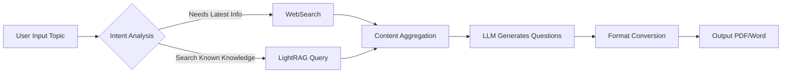
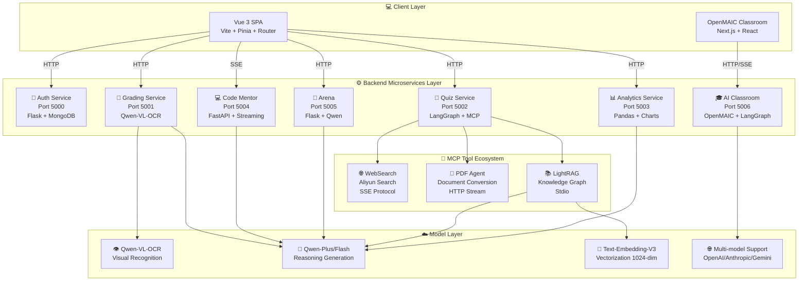

<div align="center">


# 🎓 Teacher Assistant AI (师小助)

### Next-Generation Intelligent Teaching Assistant Platform | Powered by Agentic AI Architecture

<p align="center">
  <a href="#-core-features">Features</a> •
  <a href="#-system-architecture">Architecture</a> •
  <a href="#-quick-start">Quick Start</a> •
  <a href="#-api-documentation">API</a> •
  <a href="#-development-guide">Development</a> •
  <a href="#-contributing">Contributing</a>
</p>

[](LICENSE)
[](https://www.python.org/)
[](https://vuejs.org/)
[](https://www.langchain.com/)
[](https://www.langchain.com/langgraph)
[](https://modelcontextprotocol.io/)
[](https://dashscope.aliyun.com/)

English | [简体中文](README.md)

</div>

---

## 📖 Project Overview

**Teacher Assistant AI (师小助)** is a revolutionary educational technology platform dedicated to liberating teacher productivity and improving teaching quality through cutting-edge artificial intelligence. The project adopts an **Agentic AI** architecture, deeply integrating LangChain, LangGraph, LightRAG, and Model Context Protocol (MCP) to create a truly "thinking" intelligent teaching assistant system.

### 💡 Key Highlights

<table>
<tr>
<td width="50%">

🧠 **Autonomous Reasoning & Decision Making**
- Intelligent intent analysis, automatic tool chain selection
- Dynamic workflow orchestration, complex task decomposition

</td>
<td width="50%">

🔄 **Multimodal Processing Capabilities**
- OCR visual recognition, accurate handwritten test grading
- Code semantic analysis, Socratic teaching guidance

</td>
</tr>
<tr>
<td width="50%">

📚 **Knowledge Graph Driven**
- LightRAG deep semantic retrieval
- Five retrieval modes for flexible adaptation

</td>
<td width="50%">

🔌 **Infinite Extension Ecosystem**
- MCP protocol standardized tool interface
- One-click integration of new AI capabilities

</td>
</tr>
</table>

### 🎯 Core Value Proposition

| 🎓 For Teachers | 📚 For Students | 🏫 For Schools |
|:---:|:---:|:---:|
| Save **60%** grading time | Personalized learning paths | Data-driven decisions |
| Intelligent teaching material generation | **24/7** online Q&A | Improve teaching quality |
| Comprehensive learning analytics | Instant feedback & improvement | Reduce operational costs |

---

## ✨ Core Features

### 🧠 1. Intelligent Quiz Generation System (Agentic Quiz Generation)

An advanced quiz generation engine powered by **LangGraph workflow orchestration** + **LightRAG knowledge graph** + **MCP protocol**.

#### 🔍 Core Capabilities

| Feature Module | Description |
|:---|:---|
| **Smart Router** | Automatically analyzes user intent, intelligently switches between web search and local RAG |
| **LightRAG Engine** | Supports local/global/hybrid/mix/naive retrieval modes |
| **MCP Tool Ecosystem** | Standardized tool calling interface, supports WebSearch, PDF conversion, etc. |
| **Multi-format Output** | Auto-generates Markdown, one-click conversion to PDF/Word |

#### 📊 Workflow



---

### 📝 2. Multimodal Intelligent Grading

An automated grading system utilizing **Qwen-VL-OCR** visual large models.

#### 👁️ Visual Recognition Capabilities

| Capability | Description | Accuracy |
|:---|:---|:---:|
| Handwriting Recognition | Accurately recognizes various handwriting styles | >95% |
| Multiple Choice Extraction | Automatically identifies A/B/C/D option markings | >98% |
| Table Recognition | Supports complex formats like fill-in-the-blank, calculation questions | >90% |
| Graphics Understanding | Analyzes geometric figures, function graphs, etc. | >85% |

#### 📄 Dual-Stream Input System

```
Standard Answer Stream (.docx/.txt/.pdf)  +  Student Answer Stream (.jpg/.png/.pdf)
                    ↓
              Qwen-VL-OCR
                    ↓
           Structured Grading Report
```

#### 📊 Grading Report Structure

| 📈 Score Dashboard | 📝 Detailed Grading | 💡 Improvement Suggestions |
|:---:|:---:|:---:|
| Total score, average, ranking distribution | Score details per question, point loss analysis | Weak knowledge points, learning paths |

---

### 💻 3. AI Coding Mentor

A Socratic AI mentor designed specifically for programming education, using guided teaching rather than direct answers.

#### 🛠️ Supported Programming Languages

`Python` `Java` `C++` `JavaScript` `TypeScript` `Go` `Rust` `PHP`

#### 🔍 Review Dimensions

| Dimension | Check Items | Example |
|:---:|:---|:---|
| **Syntax Check** | Syntax errors, type errors, missing imports | `NameError: name 'pd' is not defined` |
| **Logic Analysis** | Infinite loops, unhandled exceptions, boundary conditions | Duplicate `if` statement logic |
| **Performance Optimization** | Time complexity, memory leaks | `O(n²)` → `O(n)` optimization suggestions |
| **Code Style** | PEP8/Google Style, naming conventions | Variable name `a1` → `student_count` |
| **Security** | SQL injection, XSS vulnerabilities | Detect unencrypted password storage |

#### 🎓 Teaching Mode

```
1st Help Request → Only provide metaphors and guiding questions
2nd Help Request → More specific hints, no complete code
3rd+ Requests   → Code snippet hints with key points annotated
```

---

### 📊 4. Learning Analytics Engine (Data Insight Engine)

A data insight system based on **Pandas** + **LLM** that transforms data into actionable teaching recommendations.

#### 📈 Visualization Charts

| Score Trend Chart | Subject Radar Chart | Progress/Regression Bar Chart |
|:---:|:---:|:---:|
| Progress curves for each subject | Multi-dimensional ability analysis | Class ranking changes |

#### 🤖 AI Advisor Features

- **Short-term Learning Plan** (1-3 months): Targeted training for weak knowledge points
- **Long-term Growth Path** (6-12 months): Subject balance strategies, competition development suggestions
- **Career Planning Suggestions**: Major selection tendency analysis, career interest matching

---

### 🎯 5. Prompt Arena

An interactive learning platform for training Prompt engineering skills.

#### 🎮 Core Gameplay

```
Generate Quest → Write Prompt → AI Simulates Response → Multi-dimensional Scoring → Improvement Suggestions
```

#### 📊 Scoring Dimensions

| Dimension | Description |
|:---|:---|
| **Clarity** | Is the task description clear and understandable |
| **Constraints** | Are there explicit limitations and requirements |
| **Logic** | Is the requirement description logically ordered |

---

### 🎓 6. Interactive AI Classroom (OpenMAIC)

An AI-powered interactive classroom platform based on **multi-agent collaboration**, capable of transforming any topic or document into rich interactive learning experiences.

#### 🌟 Core Capabilities

| Feature Module | Description |
|:---|:---|
| **One-click Classroom Generation** | Describe a topic or attach learning materials, AI builds a complete classroom in minutes |
| **Multi-agent Collaboration** | AI teachers and agent classmates teach, discuss, and interact in real-time |
| **Rich Scene Types** | Slides, quizzes, HTML interactive simulations, Project-Based Learning (PBL) |
| **Whiteboard & Voice** | Agents draw diagrams, write formulas, and explain with voice in real-time |
| **Flexible Export** | Download editable `.pptx` slides or interactive `.html` pages |

#### 📚 Classroom Components

| Component | Description |
|:---:|:---|
| **🎓 Slides** | AI teacher lectures with spotlight and laser pointer animations |
| **🧪 Quiz** | Interactive quizzes (single/multiple choice, short answer) with real-time AI grading |
| **🔬 Interactive Simulation** | HTML-based interactive experiments, physics simulators, flowcharts, etc. |
| **🏗️ Project-Based Learning** | Choose a role and collaborate with AI agents on structured projects |

#### 🔄 Multi-agent Interaction Modes

- **Classroom Discussion** — Agents proactively initiate discussions, users can join anytime or get called on
- **Roundtable Debate** — Multiple agents with different personas discuss topics with whiteboard illustrations
- **Q&A Mode** — Ask questions freely, AI teacher responds with slides, diagrams, or whiteboard drawings
- **Whiteboard Collaboration** — AI agents draw on shared whiteboard in real-time, solving equations step by step

#### 🛠️ Technical Architecture

| Category | Technology |
|:---:|:---|
| Core Framework | Next.js 16 + React 19 + TypeScript 5 |
| Multi-agent Orchestration | LangGraph 1.1 |
| State Management | Zustand 5 |
| Slide Rendering | Canvas + ProseMirror |
| LLM Services | OpenAI / Anthropic / Google Gemini / DeepSeek, etc. |

---

## 🏗️ System Architecture

### Technology Stack Overview

#### 🖥️ Backend Technology Stack (Python)

| Category | Technology |
|:---:|:---|
| Web Framework | Flask (Microservices) + FastAPI (Streaming Services) |
| AI Orchestration | LangChain + LangGraph |
| Knowledge Graph | LightRAG |
| Protocol Layer | Model Context Protocol (FastMCP) |
| LLM Service | Aliyun DashScope (Qwen Series) |
| Data Processing | Pandas + NumPy + Matplotlib |
| Database | MongoDB (User Authentication) |

#### 🎨 Frontend Technology Stack (Vue 3)

| Category | Technology |
|:---:|:---|
| Core Framework | Vue 3 (Composition API + `<script setup>`) |
| Build Tool | Vite 6.x |
| State Management | Pinia |
| Routing | Vue Router 4 |
| HTTP Client | Axios |
| Chart Library | ECharts |
| Styling | Scoped CSS + Flexbox/Grid |

#### 🎓 OpenMAIC Technology Stack (Next.js)

| Category | Technology |
|:---:|:---|
| Core Framework | Next.js 16 + React 19 + TypeScript 5 |
| Multi-agent Orchestration | LangGraph 1.1 |
| State Management | Zustand 5 |
| Slide Rendering | Canvas + ProseMirror |
| Whiteboard Drawing | SVG + Canvas |
| LLM Services | OpenAI / Anthropic / Google Gemini / DeepSeek, etc. |
| Styling | Tailwind CSS 4 |

### 🏛️ System Architecture Diagram



### 📂 Project Directory Structure

```
Teacher_Assistant_AI/
├── 📁 backend/                      # Backend Services
│   ├── 📁 Login/                    # Authentication Module
│   │   └── login.py                 # Auth Service (Port 5000)
│   │
│   ├── 📁 Paper_marking/            # Intelligent Grading Module
│   │   └── marking.py               # Grading Service (Port 5001)
│   │
│   ├── 📁 Paper_composition/        # Intelligent Quiz Module
│   │   ├── main.py                  # Quiz Main Service (Port 5002)
│   │   ├── RAG_MCP_LightRAG.py      # LightRAG MCP Server
│   │   ├── lightrag_config.py       # LightRAG Configuration
│   │   └── lightrag_storage/        # Knowledge Base Storage
│   │
│   ├── 📁 Achievement_analysis/     # Learning Analytics Module
│   │   └── data_analyzer.py         # Analytics Service (Port 5003)
│   │
│   ├── 📁 Code_correction/          # Code Review Module
│   │   └── Code_correction.py       # Coding Mentor Service (Port 5004)
│   │
│   ├── 📁 Prompt_arena/             # Prompt Arena
│   │   ├── main.py                  # Arena Service (Port 5005)
│   │   └── services.py              # Business Logic
│   │
│   ├── 📁 OpenMAIC/                 # Interactive AI Classroom Module
│   │   ├── 📁 app/                  # Next.js App Router
│   │   │   ├── 📁 api/              # Server API Routes
│   │   │   │   ├── 📁 generate/     # Scene Generation Pipeline
│   │   │   │   ├── 📁 chat/         # Multi-agent Discussion
│   │   │   │   ├── 📁 pbl/          # Project-Based Learning Endpoints
│   │   │   │   └── ...              # Other API Endpoints
│   │   │   ├── 📁 classroom/        # Classroom Playback Page
│   │   │   └── page.tsx             # Home Page
│   │   ├── 📁 lib/                  # Core Business Logic
│   │   │   ├── 📁 generation/       # Two-stage Classroom Generation Pipeline
│   │   │   ├── 📁 orchestration/    # LangGraph Multi-agent Orchestration
│   │   │   ├── 📁 playback/         # Playback State Machine
│   │   │   ├── 📁 action/           # Action Execution Engine
│   │   │   └── ...                  # Other Core Modules
│   │   ├── 📁 components/           # React UI Components
│   │   │   ├── 📁 slide-renderer/   # Slide Editor and Renderer
│   │   │   ├── 📁 scene-renderers/  # Scene Renderers
│   │   │   ├── 📁 whiteboard/       # Whiteboard Drawing Components
│   │   │   └── ...                  # Other Components
│   │   ├── package.json             # Node.js Dependencies
│   │   └── .env.example             # Environment Variables Template
│   │
│   ├── 📁 logs/                     # Log Storage
│   ├── main.py                      # Unified Startup Script
│   └── requirements.txt             # Python Dependencies
│
├── 📁 frontend/                     # Frontend Project
│   ├── src/
│   │   ├── components/              # Page Components
│   │   │   ├── Login.vue            # Login Page
│   │   │   ├── Index.vue            # Home Page
│   │   │   ├── intelligent-quiz.vue # Intelligent Quiz
│   │   │   ├── intelligent-correction.vue # Intelligent Grading
│   │   │   ├── score-analysis.vue   # Score Analysis
│   │   │   ├── code-review.vue      # Code Review
│   │   │   └── PromptArena.vue      # Prompt Arena
│   │   ├── config/api.js            # API Configuration
│   │   ├── router/index.js          # Router Configuration
│   │   ├── store/user.js            # User State
│   │   └── App.vue                  # Root Component
│   ├── static/                      # Static Resources
│   ├── index.html
│   ├── package.json
│   └── vite.config.js
│
├── 📁 Files/                        # Sample Files
├── .env.example                     # Environment Variables Template
├── .gitignore
├── LICENSE
├── README.md                        # Chinese Documentation
└── README_EN.md                     # English Documentation
```

---

## 🚀 Quick Start

### 📋 Prerequisites

| Dependency | Version Required | Download Link |
|:---:|:---:|:---:|
| Python | 3.10+ | [Download](https://www.python.org/downloads/) |
| Node.js | 16.x+ | [Download](https://nodejs.org/) |
| MongoDB | 4.x+ | [Download](https://www.mongodb.com/) |
| DashScope API Key | - | [Get Key](https://dashscope.aliyun.com/) |

### 📥 1. Clone the Project

```bash
# HTTPS
git clone https://github.com/abaiar/Teacher_Assistant_AI.git

# SSH (Recommended)
git clone git@github.com:abaiar/Teacher_Assistant_AI.git

cd Teacher_Assistant_AI
```

### 🐍 2. Backend Environment Setup

#### 2.1 Create Virtual Environment

```bash
# Conda (Recommended)
conda create -n teacher_ai python=3.10
conda activate teacher_ai

# venv
python -m venv venv
# Windows
venv\Scripts\activate
# Linux/macOS
source venv/bin/activate
```

#### 2.2 Install Dependencies

```bash
pip install -r backend/requirements.txt

# China mirror acceleration
pip install -r backend/requirements.txt -i https://pypi.tuna.tsinghua.edu.cn/simple
```

#### 2.3 Configure Environment Variables

```bash
# Copy template
cp .env.example .env
```

Edit the `.env` file:

```env
# Required
DASHSCOPE_API_KEY=sk-xxxxxxxxxxxxxxxxxxxxxxxx

# Optional
ALI_MODEL_NAME=qwen-plus
USE_LIGHTRAG=true
```

#### 2.4 Start Backend Services

**Option 1: Unified Startup (Recommended)**

```bash
cd backend
python main.py
```

**Option 2: Start Services Individually**

```bash
# Auth Service (Port 5000)
python backend/Login/login.py

# Grading Service (Port 5001)
python backend/Paper_marking/marking.py

# Quiz Service (Port 5002)
python backend/Paper_composition/main.py

# Analytics Service (Port 5003)
python backend/Achievement_analysis/data_analyzer.py

# Code Mentor (Port 5004)
python backend/Code_correction/Code_correction.py

# Arena (Port 5005)
python backend/Prompt_arena/main.py
```

#### 2.5 Verify Services

```bash
curl http://localhost:5002/health
curl http://localhost:5003/test
curl http://localhost:5004/health
curl http://localhost:5005/api/prompt_arena/health
curl http://localhost:5006/api/health
```

### 🎨 3. Frontend Environment Setup

```bash
cd frontend

# Install dependencies
npm install
# or
yarn install
# or
pnpm install

# Start development server
npm run dev
```

Visit `http://localhost:5173` to access the application.

**Default Test Account**:
- Username: `teacher`
- Password: `123456`

---

### 🎓 4. OpenMAIC Interactive Classroom Setup

#### 4.1 Prerequisites

| Dependency | Version Required |
|:---:|:---:|
| Node.js | >= 20 |
| pnpm | >= 10 |

#### 4.2 Install Dependencies

```bash
cd backend/OpenMAIC
pnpm install
```

#### 4.3 Configure Environment Variables

```bash
cp .env.example .env.local
```

Edit the `.env.local` file and configure at least one LLM provider API key:

```env
# OpenAI
OPENAI_API_KEY=sk-...

# Anthropic
ANTHROPIC_API_KEY=sk-ant-...

# Google Gemini
GOOGLE_API_KEY=...

# DeepSeek
DEEPSEEK_API_KEY=...

# Aliyun Qwen
QWEN_API_KEY=...
```

> **Recommended Model**: **Gemini 3 Flash** — best balance of quality and speed. For highest quality, try **Gemini 3.1 Pro**.

#### 4.4 Start Services

**Option 1: One-click Startup (Recommended)**

OpenMAIC service is integrated into the main startup script. Execute the following command to automatically start all services (including OpenMAIC):

```bash
cd backend
python main.py
```

After startup, visit `http://localhost:5006` to access the interactive classroom.

**Option 2: Start OpenMAIC Service Individually**

To start OpenMAIC service separately:

```bash
cd backend/OpenMAIC

# Development mode
set PORT=5006
pnpm dev

# Or production mode
set PORT=5006
pnpm build
pnpm start
```

> **Note**: On Windows, use `set PORT=5006` to set environment variable. On Linux/macOS, use `export PORT=5006`.

#### 4.5 Optional Configuration

| Configuration | Description |
|:---|:---|
| **TTS (Text-to-Speech)** | Supports OpenAI, Azure, GLM, Qwen voice services |
| **ASR (Speech Recognition)** | Supports OpenAI, Qwen speech recognition services |
| **Image Generation** | Supports Seedream, Qwen Image generation services |
| **Video Generation** | Supports Seedance, Kling, Veo video generation services |
| **PDF Parsing** | Supports MinerU enhanced document parsing |

---

## 📚 API Documentation

### 🔐 Authentication Service (Port 5000)

#### User Login

```http
POST /login
Content-Type: application/x-www-form-urlencoded

username=teacher&password=123456
```

**Response**

```json
{
  "success": true,
  "message": "Login successful",
  "user": {
    "username": "teacher",
    "role": "teacher",
    "token": "jwt-token"
  }
}
```

#### User Registration

```http
POST /register
Content-Type: application/x-www-form-urlencoded

username=newuser&password=password123
```

---

### 📝 Grading Service (Port 5001)

#### Intelligent Grading

```http
POST /correct
Content-Type: multipart/form-data

standard_answer: <Word file>
student_answer: <Image file>
```

**Response**

```markdown
# 📝 Intelligent Grading Report

## 📊 Score Dashboard
| Dimension | Data | Notes |
| :--- | :--- | :--- |
| **Estimated Score** | 85 / 100 | - |
| **Correct Answers** | 17 / 20 | - |

## 🔍 Detailed Grading
### Question 1
- **Status**: ✅
- **Student Answer**: A
- **Correct Answer**: A
- **Comment**: Correctly understood the concept...
```

---

### 🧠 Quiz Service (Port 5002)

#### Generate Quiz

```http
POST /generate_quiz
Content-Type: application/json

{
  "query": "High School Math: Applications of Derivatives, include 10 multiple choice questions"
}
```

**Response**

```json
{
  "quiz_markdown": "## I. Multiple Choice\n\n1. Given function f(x) = x³ - 3x...",
  "pdf_url": "https://example.com/quiz.pdf"
}
```

---

### 📊 Analytics Service (Port 5003)

#### Learning Analytics

```http
POST /analyze
Content-Type: multipart/form-data

dataType: json
students: [{"name": "John", "scores": {"Math": 85, "English": 90}}]
```

**Response**

```json
[
  {
    "name": "John",
    "analysis": "This student has a solid foundation in mathematics...",
    "shortPlan": "Short-term suggestion: strengthen function chapter practice...",
    "longPlan": "Long-term planning: recommend participating in math competitions...",
    "careerAdvice": "Suitable majors: Computer Science, Financial Engineering...",
    "encouragement": "Keep it up, you're doing great!",
    "charts": {
      "bar_chart": "base64...",
      "radar_chart": "base64...",
      "trend_chart": "base64..."
    }
  }
]
```

---

### 💻 Code Mentor Service (Port 5004)

#### Socratic Dialogue (Streaming)

```http
POST /api/mentor/chat
Content-Type: application/json

{
  "code": "for i in range(10)\n    print(i)",
  "error_message": "SyntaxError: invalid syntax",
  "language": "Python",
  "session_id": "user-123",
  "user_message": "Help me find what's wrong"
}
```

**Response** (SSE Streaming)

```
🤔 **Teacher Assistant found a problem**

Your code is like forgetting to add a period when speaking...

💡 **Hint**
Python's for loop needs a colon after it!

🎯 **Next Step**
Try adding a colon `:` after `range(10)`
```

#### Code Story Explanation

```http
POST /api/mentor/explain
Content-Type: application/json

{
  "code": "for i in range(5):\n    print(i)",
  "language": "Python"
}
```

**Response**

```json
{
  "status": "success",
  "data": [
    {"line": 1, "desc": "We're starting a magical loop journey, like running laps on a track, we'll run 5 laps..."},
    {"line": 2, "desc": "After each lap, we shout out which lap we're on..."}
  ]
}
```

---

### 🎯 Arena Service (Port 5005)

#### Generate New Quest

```http
POST /api/prompt_arena/new_quest
Content-Type: application/json

{
  "use_ai": true
}
```

**Response**

```json
{
  "success": true,
  "quest": {
    "quest_id": "quest_001",
    "category": "Code Generation",
    "scenario": "You need AI to help you write a sorting function",
    "objective": "Generate a Python quicksort function",
    "constraints": ["Must include comments", "Time complexity O(n log n)"],
    "difficulty": "Medium"
  }
}
```

#### Evaluate Response

```http
POST /api/prompt_arena/judge
Content-Type: application/json

{
  "prompt": "Please write a quicksort function...",
  "response": "def quicksort(arr): ...",
  "quest_context": {...}
}
```

---

### 🎓 Interactive Classroom Service (Port 5006)

#### Generate Classroom

```http
POST /api/generate-classroom
Content-Type: application/json

{
  "topic": "Introduction to Quantum Physics",
  "materials": ["Optional: PDF file URL or text content"],
  "language": "en-US",
  "sceneTypes": ["slides", "quiz", "interactive", "pbl"]
}
```

**Response**

```json
{
  "jobId": "classroom_001",
  "status": "pending",
  "message": "Classroom generation task submitted"
}
```

#### Query Generation Status

```http
GET /api/generate-classroom/{jobId}
```

**Response**

```json
{
  "jobId": "classroom_001",
  "status": "completed",
  "classroomUrl": "/classroom/classroom_001",
  "scenes": [
    {"type": "slides", "title": "Introduction to Quantum Mechanics"},
    {"type": "quiz", "title": "Knowledge Quiz"},
    {"type": "interactive", "title": "Double-slit Experiment Simulation"}
  ]
}
```

#### Multi-agent Chat

```http
POST /api/chat
Content-Type: application/json

{
  "classroomId": "classroom_001",
  "message": "Please explain wave-particle duality",
  "sessionId": "user-123"
}
```

**Response** (SSE Streaming)

```
data: {"type": "speech", "agent": "teacher", "content": "Wave-particle duality is a core concept in quantum mechanics..."}

data: {"type": "whiteboard", "action": "draw", "content": {"path": "..."}}

data: {"type": "slide", "action": "navigate", "slideIndex": 3}
```

#### Export Classroom

```http
GET /api/classroom/{id}/export?format=pptx
```

**Response**: Download `.pptx` or `.html` file

---

## 🔧 Development Guide

### Code Standards

- **Python**: Follow PEP8, use type annotations
- **Vue**: Composition API + `<script setup>` syntax
- **Commit Messages**: Follow [Conventional Commits](https://www.conventionalcommits.org/)

### Local Development

```bash
# Backend development mode
cd backend
python main.py --log-level DEBUG

# Frontend development mode
cd frontend
npm run dev
```

### Adding New MCP Tools

1. Create a new MCP Server in `backend/Paper_composition/`
2. Register it in the `mcp_servers` configuration in `main.py`
3. Restart the quiz service

---

## 🐛 Troubleshooting

### Frequently Asked Questions

<details>
<summary><b>Q1: DASHSCOPE_API_KEY not found</b></summary>

**Cause**: Environment variable not properly configured

**Solution**:
```bash
# Check .env file
cat .env

# Set manually
export DASHSCOPE_API_KEY=your-key-here  # Linux/macOS
set DASHSCOPE_API_KEY=your-key-here     # Windows
```
</details>

<details>
<summary><b>Q2: Port Already in Use</b></summary>

**Solution**:
```bash
# Windows
netstat -ano | findstr :5000
taskkill /PID <PID> /F

# Linux/macOS
lsof -i :5000
kill -9 <PID>
```
</details>

<details>
<summary><b>Q3: LightRAG Initialization Failed</b></summary>

**Solution**:
1. Check permissions for `backend/Paper_composition/lightrag_storage/` directory
2. Ensure installed: `pip install lightrag`
3. Check logs: `backend/logs/lightrag.log`
</details>

<details>
<summary><b>Q4: Frontend Cannot Connect to Backend</b></summary>

**Solution**:
1. Confirm all backend services are running
2. Check CORS configuration
3. Check browser console for error messages
</details>

---

## 📊 Performance Benchmarks

**Test Environment**: Intel i7-10700K / 16GB DDR4 / Windows 10/11

| Module | Average Response Time | Concurrency | Notes |
|:---:|:---:|:---:|:---|
| Intelligent Quiz | 15-30s | 10 QPS | Depends on question count |
| LightRAG Query | 2-5s | 20 QPS | Depends on knowledge base size |
| Image Grading | 5-10s/image | 5 QPS | Resolution affects performance |
| Code Review | 3-8s | 15 QPS | Streaming output |
| Data Analysis | 10-20s | 8 QPS | Depends on student count |
| Arena | 3-5s | 15 QPS | - |
| OpenMAIC Classroom Generation | 2-5min | 5 QPS | Depends on scene count |
| OpenMAIC Multi-agent Chat | 1-3s | 20 QPS | SSE streaming output |

---

## 🤝 Contributing

We welcome all forms of contributions!

### Contribution Process

```bash
# 1. Fork and clone
git clone https://github.com/your-username/Teacher_Assistant_AI.git

# 2. Create branch
git checkout -b feature/your-feature

# 3. Commit changes
git commit -m "feat: add new feature"

# 4. Push branch
git push origin feature/your-feature

# 5. Create Pull Request
```

### Contribution Types

- 🐛 Bug fixes
- ✨ New feature development
- 📝 Documentation improvements
- 🌐 Translation contributions
- 💡 Feature suggestions

---

## 📄 License

This project is open-sourced under the [MIT License](LICENSE).

```
MIT License

Copyright (c) 2024-2025 Teacher Assistant AI Contributors

Permission is hereby granted, free of charge, to any person obtaining a copy
of this software and associated documentation files (the "Software"), to deal
in the Software without restriction, including without limitation the rights
to use, copy, modify, merge, publish, distribute, sublicense, and/or sell
copies of the Software, and to permit persons to whom the Software is
furnished to do so, subject to the following conditions:

The above copyright notice and this permission notice shall be included in all
copies or substantial portions of the Software.
```

---

## 🙏 Acknowledgments

Thanks to the following open-source projects for their support:

| Project | Description |
|:---:|:---|
| [LangChain](https://www.langchain.com/) | AI Application Development Framework |
| [LangGraph](https://www.langchain.com/langgraph) | Workflow Orchestration Engine |
| [LightRAG](https://github.com/HKUDS/LightRAG) | Knowledge Graph Retrieval Framework |
| [FastMCP](https://modelcontextprotocol.io/) | MCP Protocol Implementation |
| [DashScope](https://dashscope.aliyun.com/) | Alibaba Cloud LLM Service |
| [Vue.js](https://vuejs.org/) | Progressive Frontend Framework |
| [Flask](https://flask.palletsprojects.com/) | Python Web Framework |

### 🎓 OpenMAIC Acknowledgments

The Interactive AI Classroom module is developed based on the [OpenMAIC](https://github.com/THU-MAIC/OpenMAIC) open-source project. Special thanks to the Tsinghua University MAIC team for their outstanding contributions:

- **Project URL**: https://github.com/THU-MAIC/OpenMAIC
- **Paper**: [From MOOC to MAIC: Reimagine Online Teaching and Learning through LLM-driven Agents](https://jcst.ict.ac.cn/en/article/doi/10.1007/s11390-025-6000-0)
- **License**: AGPL-3.0

```bibtex
@Article{JCST-2509-16000,
  title = {From MOOC to MAIC: Reimagine Online Teaching and Learning through LLM-driven Agents},
  journal = {Journal of Computer Science and Technology},
  year = {2026},
  doi = {10.1007/s11390-025-6000-0},
  author = {Ji-Fan Yu and Daniel Zhang-Li and Zhe-Yuan Zhang and others}
}
```

---

## 📞 Contact

- **GitHub**: [abaiar/Teacher_Assistant_AI](https://github.com/abaiar/Teacher_Assistant_AI)
- **Issues**: [GitHub Issues](https://github.com/abaiar/Teacher_Assistant_AI/issues)

---

<div align="center">

**[⬆ Back to Top](#-teacher-assistant-ai-师小助)**

Made with ❤️ by Teacher Assistant AI Team

⭐ If this project helps you, please give it a Star!

</div>
